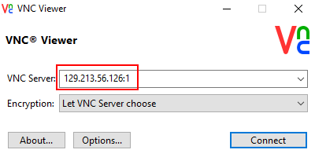
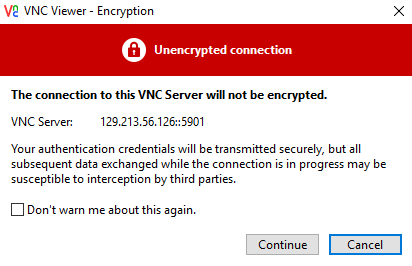
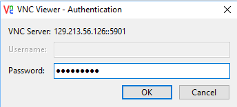

# Introduction to Docker on the Oracle Cloud

 

Updated: June 23, 2018

## Oracle Cloud Infrastructure Overview

With a comprehensive offering that includes compute, storage, network, bare metal, and container services, Oracle’s infrastructure services drive business value. Our enterprise-grade cloud enables organizations to run any workload at any time, while innovative migration tools pave the way by simplifying how organizations migrate on-premises workloads to the cloud.

This introduction provisions a Docker multi-container application running in the Compute Cloud Service on a VM Standard footprint. There are many options to choose from in Oracle's IaaS arena.


## Docker Overview

What is Docker? What is a container?

- Docker is the company and containerization technology.
- [Docker Documentation](https://docs.docker.com)
- A container is a runtime instance of a docker image: [Container Documentation](https://docs.docker.com/glossary/?term=container)

Containers have been around for many years. Docker created a technology that was usable by mere humans, and was much easier to understand than before. Thus, has enjoyed a tremendous amount of support for creating a technology for packaging applications to be portable and lightweight.

### VM vs Container


While containers may sound like a virtual machine (VM), the two are distinct technologies. With VMs each virtual machine includes the application, the necessary binaries and libraries and the entire guest operating system.

Whereas, Containers include the application, all of its dependencies, but share the kernel with other containers and are not tied to any specific infrastructure, other than having the Docker engine installed on it’s host – allowing containers to run on almost any computer, infrastructure and cloud.

## Lab Introduction

In this lab you will be looking at various application components deployed in three Docker containers. The AlphaOffice application offers a list of products from a catalog. Refering to the `Product Catalog Application` section of the diagram below we see four Docker containers. 

**NOTE:** In this lab deployment the "database" product catalog is bundled with the REST service. The product listing is provided via JSON. In the full blown deployment available as a follow-up lab, you use an Oracle or MYSQL database as the datasource.

The AlphaOffice UI container retrieves catalog information from a REST service (written in Node.js) running in a separate container. It also takes in sample Twitter feed data from a REST service (written in Java), also running in its own container, and combines the data into a unified front end.


## Objectives

- Connect into your account using VNC Viewer
- Do some docker commands to see various aspects of the set up
- Use the AlphaOffice application
- Go into the UI Docker container and make small changes in the application.

## Required Artifacts

- Once the infrastructure is provisioned you can access your enironment using `VNC Viewer`. Please download and install from: [VNC Viewer](https://www.realvnc.com/en/connect/download/viewer/)

# Start the Demo Lab

-  **Launch the Demo Lab**

   

- **In 6 minutes the Oracle IaaS infrastructure including the Application already running and deployed will be available.**

  

- While you're waiting, check out the short video that gives an overview of this session if you have not already done so:

  

- When the environment is ready you will see the following along with the connect string to put into VNC Viewer. (In this example 129.213.56.126:1. Your IP address will be different)

  

- **You have 30 minutes** before the environment will go away.

  

## Log into your Account

Using VNC Viewer connect into the newly provisioned account.

### **STEP 1**: Start VNC Viewer

- Enter the connect string you were given (Example Shown):

  

- If presented with this prompt, just click **Continue**

  

- Enter the VNC password  **Qloudable** 

  

- You should now see your Desktop:

  

 ### **STEP 2**: AlphaOffice Application

 Run the AlphaOffice Application

- Click on the **Applications** tab and select **Firefox Web Browser**

  

- **Type** in the URL: **localhost:8085**

  

- The Application is displayed. **NOTE:** There is a typo in the tab (Aplha). You will fix this in a few minutes...

  

- Click on the **Crayola Markers** product to see associated Twitter feeds.

  

- **Minimize the browser**. We will come back to it later.

## Explore the Docker environment

Run some Docker commands to explore details of the installation and the AlphaOffice containers

### **STEP 1**: Run some Docker Commands

Open a terminal session

- On the desktop **right-click** and select **Open Terminal**

    

- **Type** the following:

```
su - opc
docker version
```

This takes us into the `opc` user and shows the current Docker version (`18.03`)


- **Type** the following to see what Docker containers are running:

```
docker ps
```

  

The output shows three containers running named:
```
alphaofficeui
restclient
twitterfeed
``` 
The unique container ID that docker assigns at runtime is shown along with the startup command and the networking ports that the containers have exposed. These are mapped to the HOST operating sytem's server ports for external consumption. The TwitterFeed Java application is running on port 9080, the RESTClient is on port 8002 and the AlphaOffice UI is on port 8085.

Docker uses a default network called `bridge` and assigns virtual IP addresses to each container. Any containers on the same network subnet can implicity see each other.

- **Type** the Following:

```
docker network ls
```

  

- `docker inspect` will show us all details of a particular container. Storage locations, storage volumes, storage types, networking subnet, IP address and much more. To get information on the `restclient` container, for example, **Type** the following:

```
docker inspect restclient
```

Scroll back through the JSON output. We will touch on a couple of sections:

  

The output above shows the Creation Date, container status, The process ID (`2351`) on the HOST operating system, the path location on the HOST where container specific information is stored (`/var/lib/docker/...`), the type of storage overlay that Docker is using on the HOST opearating system (In this case, `overlay2`)

- Take the PID (Process ID) of the `restclient` container and see what is running on the HOST (In this example the process ID is 2390. Substitute your <PID> in its place).

- **Type** the following:

```
docker ps -ef | grep <PID>
```

You'll see a Node.js application `server.js` running:


- Now, go into the `restclient` container and see what is running there. **Type** the following sequence; 1) `bash` into the container, 2) `ps -ef`, 3) `exit` out of the container

```
docker exec -it restcleint bash
ps -ef
exit
```
You'll notice the same application running...


Now, looking further at the `restclient` inspection output:

  

The output above shows the arbitrarily assigned hostname (You can give the container a hostname on startup if you want), and the HOST exposed network port (`8002`)

    

The output above shows networking specifics for the container. The Docker virtual network that it's on (`bridge`), the ports the container is using (`8002`) and the assigned IP address (`172.17.0.4`)

 - **Cut and Paste** the following to get a list of all IP addresses from the current running containers:

 ```
 docker ps -q | xargs -n 1 docker inspect --format '{{range .NetworkSettings.Networks}}{{.IPAddress}}{{end}} {{ .Name }}' | sed 's/ \// /'
 ```
Example output (your IP assignments may vary):

    

# Make changes to the AlphaOffice application

In this section you will make a couple of changes to the AlphaOfficeUI application. One will correct a typo and another will change the background image. The flow for this will be as follows:

- Copy the new background image into the container
- Connect into the AlphaOfficeUI container
- Install the vim text editor
- Fix a typo and specify the new background image
- Save (docker commit) a copy of the changes to a NEW docker image
- Start up and test the AlphaOfficeUI container using the NEW image

## Container In-place Modifications

### **STEP 1**: Copy a New Background Image

Copy a background image file into the running AlphaOfficeUI container. This file is in the `/home/opc/AlphaOfficeSetup` directory.

**NOTE:** Make sure you are still logged in as the `opc` user. You can check by typing `whoami`. If you are the root user for some reason then Type `su - opc` to login as the opc user.

- **Type or Cut and Paste** the following:

```
docker cp /home/opc/AlphaOfficeSetup/dark_blue.jpg alphaofficeui:/pipeline/source/public/Images
```

  Example: `docker cp /home/opc/AlphaOfficeSetup/dark_blue.jpg alphaofficeui:/pipeline/source/public/Images`

### **STEP 2**: Install the VIM editor in the UI container

Even though the orginal AlphaOfficeUI image could have been set up ahead of time with any needed client tools we're adding the the environment on-the-fly to give you some idea that it can be done

- Connect into the `alphaofficeui` container:

```
docker exec -it alphaofficeui bash
```

- **Type** the following:

```
apt-get update
```


- Verify the "**dark_blue.jpg**" file is in the container by **typing**:

```
ls /pipeline/source/public/Images
```


### **STEP 3**: Edit the alpha.html file   

- Edit the `alpha.html` file to fix a typo - Note, if you are unfamiliar with `vim`, you'll find information at this URL: [VIM](http://vimsheet.com). The commands are very similar to vi:

```
vim /pipeline/source/public/alpha.html
```

- Fix the header title to read "**Alpha Office Product Catalog**". You can also change the body title to whatever you want:


- Save the file and exit by hitting the **ESC** key and then holding the **SHIFT** key down and typing "**Z**" TWICE

### **STEP 4**: Edit the alpha.css file

- **Type** the following:

```
vim /pipeline/source/public/css/alpha.css
```

- Change the background image reference to **dark_blue.jpg**


- Save the file and exit by hitting the **ESC** key and then holding the **SHIFT** key down and typing "**Z**" TWICE

- **Exit** out of the container:

```
exit
```

## Commit and run the NEW version of AlphaOffice

Commit and Test the changes

### **STEP 1**: Commit a NEW Docker image

In this step you will save a copy of your modifed docker container and give it a new name. (**NOTE:** You're back out in the HOST now). You can assign whatever <`image-name`> you want.
**NOTE:** \<image-name> must be in lower case.

- **Type** in following:

```
docker commit alphaofficeui jumpstart/<image-name>
```
  
- Example: `docker commit alphaofficeui jumpstart/alphaoffice-new`

- **Type** the following:

```
docker images
```

 - The new image is available:


### **STEP 2**: Start a container based on your new image

**Stop** and **remove** the currently running AlphaOfficeUI container. Then, start a new container based on your changes.

- **Type** the following:

```
docker stop alphaofficeui
docker rm alphaofficeui
```

Start a container using your new Docker image.

- Let's take a look at what the docker **run** command options do:
    - "-d" flag runs the container in the background
    - "--restart unless-stopped" Restarts the container if it goes down unexpectedly... UNLESS it is stopped manually
    - "--name" The name of the container will be "alphaofficeui"
    - "-p" Port 8085 is mapped from the container to the same port on the HOST

- **Cut and Paste OR Type** the following:

```
docker run -d --restart unless-stopped --name=alphaofficeui -p=8085:8085 jumpstart/<image-name>
```

- Example: `docker run -d --restart unless-stopped --name=alphaofficeui -p=8085:8085  jumpstart/alphaoffice-new`

- Verify the new container is running by **typing**:

```
docker ps
```


- If your browser is still minimized then maximize it and refresh the AlphaOffice tab. If it's closed, then restart Firefox from the Desktop `Applications` tab and go to:

```
http://localhost:8085
```


# Where do I go from here?

If you would like to experience a more in-depth look at how this Docker infrastructure was created in the Oracle Cloud and how the AlphaOffice application can be deployed using an Oracle OR MYSQL database as the RESTclient datasource please go to: **\<link-goes-here>**

- **NOTE:** When the Lab's allotted time has expired (30 minutes) you will see the following:

  

**This completes the Jump Start**
