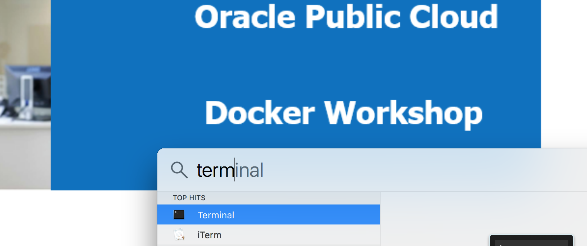
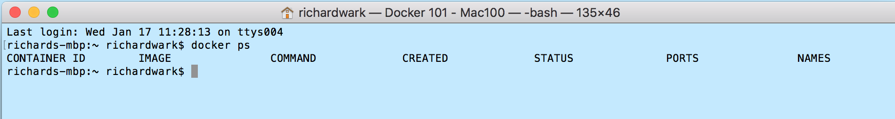
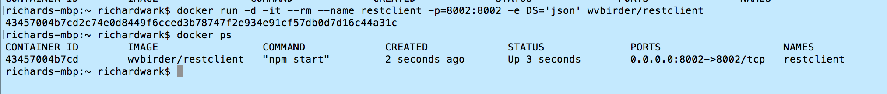
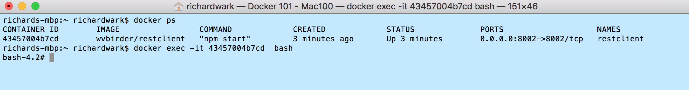
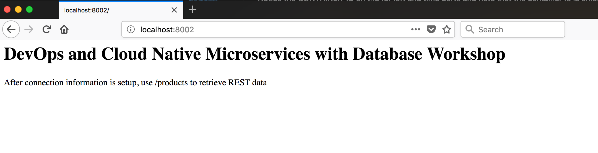
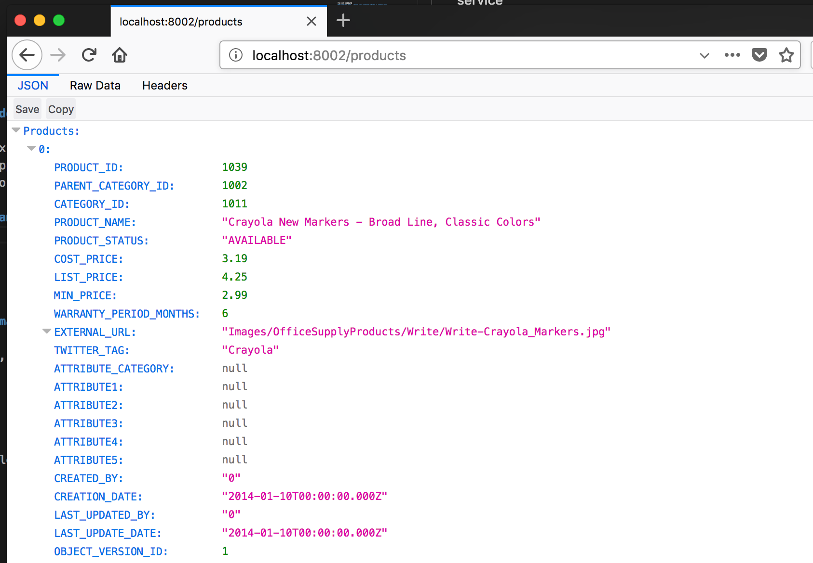
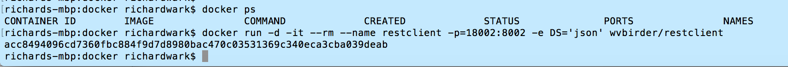
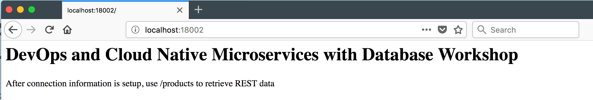
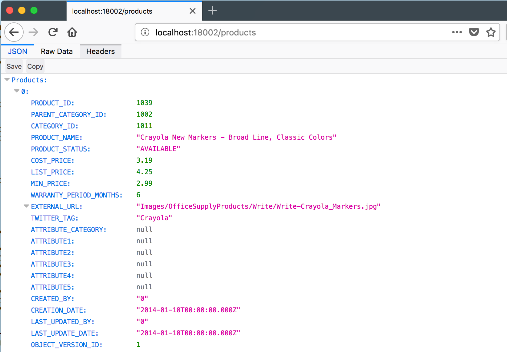

# Docker Workshop

 

Updated: January 29, 2018

## Overview

What is Docker? What is a container?

- Docker is the company and containerization technology.
- [Docker Documentation](https://docs.docker.com)
- A container is a runtime instance of a docker image: [Container Documentation](https://docs.docker.com/glossary/?term=container)

Containers have been around for many years. Docker created a technology that was usable by mere humans, and was much easier to understand than before. Thus, has enjoyed a tremendous amount of support for creating a technology for packaging applications to be portable and lightweight.

### VM vs Container


While containers may sound like a virtual machine (VM), the two are distinct technologies. With VMs each virtual machine includes the application, the necessary binaries and libraries and the entire guest operating system.

Whereas, Containers include the application, all of its dependencies, but share the kernel with other containers and are not tied to any specific infrastructure, other than having the Docker engine installed on it’s host – allowing containers to run on almost any computer, infrastructure and cloud.

## Introduction

In this lab we introduce some basic concepts of Docker, container architectures and functions.  We will do this using a single container which provides a REST service as part of a node.js application.  The application has two pieces, which provide a microservice.

- Datasource: a simple JSON file included in the container
- REST Client: To serve up data from the datasource

You will use various Docker commands to setup, run and connect into containers. In this introduction you will explore concepts of Docker volumes, networking and container architecture.

***To log issues***, click here to go to the [github oracle](https://github.com/oracle/learning-library/issues/new) repository issue submission form.

## Objectives

- Deploy and test a simple docker container running a simple application
- Introduce and use the Dockerhub registry
- Familiarize yourself with Docker commands (ps, run, exec)
- Understand foundational concepts of container networking and filesystem mapping

## Required Artifacts

- Docker Hub Account: [Docker Hub](https://hub.docker.com/)
- Docker and GIT installed in your own Mac environment (this guide is tailored to Mac) you can decide if you want to run locally. ***OR***, you can use an available Linux based VirtualBox image

# Start up and login into your Mac environment

If you chose to use your own Mac then login and verify that the Docker engine is up and running.

## Verify Docker Installation

### **STEP 1**: Open up a Terminal Window

- On your mac, hit **Command+Space** and search for `terminal` to open up a terminal session.



### **STEP 2**: Verify that Docker is running

- **Type** the following:

    ```
    cd
    docker version
    ```

The information on your docker engine should be displayed:


### **STEP 3**: See What is running

Let's take a quick look at what is running in the docker engine, if this is a new environment, you should see no docker containers running.

- **Type** the following into the terminal window:

    ```
    docker ps
    ```



### **STEP 4**: Run the restclient docker image from docker hub

We will now download and create a container based on an existing docker image stored in the Docker Hub. It uses a JSON formatted datafile to serve the test data via its exposed REST service.

- Let's take a look at what the docker **run** command options do:
    - "-d" flag runs the container in the background
    - "-it" flags instructs Docker to allocate a pseudo-TTY connected to the
    container’s stdin, creating an interactive bash capable shell in the container (which we will use in a moment when we connect into the container)
    - "--rm" When this container is stopped all resources associated with it (storage, etc) will be deleted
    - "--name" The name of the container will be "restclient"
    - "-p" Port 8002 is mapped from the container to port 8002 on the HOST
    - "-e" Environment variables used by the application. "DS" setting designates the JSON datasource.

- **Type OR cut and paste** the following (all on one line):

    ```
    docker run -d -it --rm --name restclient -p=8002:8002 -e DS='json' wvbirder/restclient
    ```



### **STEP 5**: Check running containers

- Using the docker ps command, we should see our newly spawned docker container. **Type** fhe following command:

    ```
    docker ps
    ```

- Note that the container id is unique, and the container's port is mapped to 8002, which is the same as the Host's port.



### **STEP 6**: Check the Application with a browser

- Navigate in a browser to:
```
http://localhost:8002/
```



- Now enter this URL into your brower: `http://localhost:8002/products`



- Now, let's start the container using the host's **18002** port. **Enter the following** into the Terminal window to stop the version running on port 8002, and restart on port 18002:

    ```
    docker stop restclient
    docker run -d -it --rm --name restclient -p=18002:8002 -e DS='json' wvbirder/restclient
    docker ps
    ```



- If you change your browsers port to 18002, you will see that the Host server is using 18002 and mapping that to our container's port 8002.



- Adding `/products` to the URL allows you see the results of the REST endpoint



- Finally, **STOP** the `restclient` container as we will be re-using it in Lab 200 by **typing**:

```
docker stop restclient
```

**This completes the Lab!**
