# Docker Workshop

  
Updated: January 16, 2018

## Introduction

In this lab we will explore more features of Docker and deploy a fully functional containerized version of the AlphaOffice application touched upon in Lab 100. The application is made up of the following four containers:
  - Datasource: Your choice of Oracle 12c Enterprise Edition or MYSQL
  - REST Client: To serve up data from the datasource
  - TwitterFeed: Static Twitter posts related to products in the datasource
  - AlphaOffice UI: Node.js application that makes REST calls to the RESTClient
    and TwitterFeed containers     

You will use various Docker commands to setup, run and connect into containers. Concepts of Docker volumes, networking and intra-container communication will be used.

***To log issues***, click here to go to the [github oracle](https://github.com/oracle/learning-library/issues/new) repository issue submission form.

## Objectives

- Deploy and test the AlphaOffice application
    - Choose and configure your datasource
    - Deploy the datasource, TwitterFeed, RESTClient and AlphaOfficeUI containers
- Once the application has been deployed
    - Make changes
    - Create a new Docker image
    - Fire up a container based on the new image
    - Push this image your personal Docker Hub account

## Required Artifacts

- Docker Hub Account: [Docker Hub](https://hub.docker.com/)
- Docker and GIT installed in your own Mac environment (this guide is tailored to Mac) you can deside if you want to run locally. ***OR***, you can use an available Linux based VirtualBox image

# Start up and login into your Mac environment

When using your own Mac, login and verify that the Docker engine is up and running. 

## Verify Docker Installation

### **STEP 1**: Open up a Terminal Window

- Use **Command+Space** to search for and open up a terminal session.


### **STEP 2**: Verify that Docker is running

- **Type** the following into the terminal window:

    ```
    cd
    docker version
    ```

The information on your docker engine should be displayed:

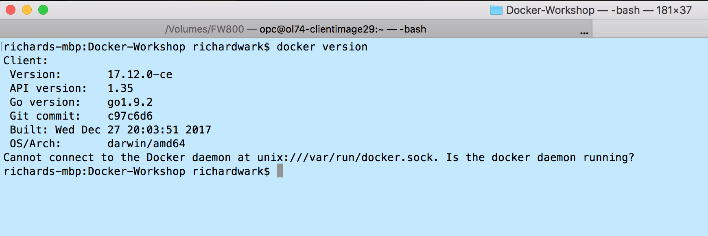

### **STEP 3**: Clone the setup scripts

- **Make note of your current directly**, as you will clone a git repository that directly. In subsequent steps, you will be asked to use the full directory name of the repository directory.
- The following command will create a directory called AlphaOfficeSetup in your $HOME directory. **Cut and Paste**, OR **Type** the following:

    ```
    git clone https://github.com/wvbirder/AlphaOfficeSetup.git
    ```

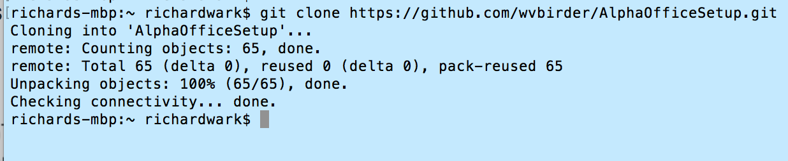

### **STEP 4**: Set Permissions

- We will be mounting the AlphaOfficeSetup directory to a directory within the Docker database container. To ensure that the "oracle" user (Oracle database) or "root" user (MYSQL database) inside of your database container will have RW capabilities to the HOST's volume, you need to run the following command. **Type** the following into your terminal window:

    ```
    chmod -R 777 Alpha*
    ```

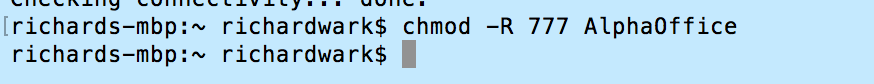

### **STEP 5**: Login using your Docker Hub credentials

- **Type** the following:

    ```
    docker login
    ```
- When prompted, enter your **username/password**. Example shown here:

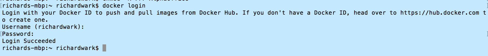

# Deploy and Configure AlphaOffice Database

## Choose the Datasource

In this section your going to chose and setup a datasource for the application. You have a choice between an Oracle 12c database, or a MYSQL database. As the steps and commands are slightly different, pick one of the flows below. You will start up a database container, connect into the container and run a script that loads the application's schema into the database.

**NOTE:** ***You only have to set up ONE database (Oracle or MYSQL) to use with the AlphaOffice application, but can go through the setup of both, if you'd like.***

## Oracle Database Setup

### **STEP 1**: Create the database container

This docker command will create a container based on the database image file located in the wvbirder/database-enterprise repository having the tag: 12.2.0.1-slim. 

- Let's take a look at what the docker **run** command options do:
    - "-d" flag runs the container in the background
    - "-it" flags instructs docker to allocate a pseudo-TTY connected to the container’s stdin, creating an interactive bash capable shell in the container (which we will use in a moment when we connect into the container)
    - "-h" We give the container a hostname "oracledb-ao" to make it easier to
    start/stop/remove, reference from other containers, etc
    - "-p" We map ports 1521 and 5600 from within the container to the same ports on
    the HOST for accessibility from outside of the container's private subnet (typically 172.17.0.0/16). This allows the container to be accessed from the HOST, for example. The default port for Oracle's tns listener is on port 1521 and port 5600 is used for HTTP access to Enterprise Manager Express
    - "--name" The name of the container will be "orcl"
    - "-v" This maps the directory where you downloaded the AlphaOfficeSetup GIT
    repository to the /dbfiles directory within the container 

- **Type OR cut and paste** (all on one line) the following, but ***Substitute*** the **YOUR-HOME** place holder with the directory name where you loaded the AlphaofficeSetup GIT repository. For Example: `/YOUR-HOME/AlphaOfficeSetup` might change to this `~/AlphaOfficeSetup`, if you loaded the git repository in your home directory.

    ```
    docker run -d -it --name orcl -h='oracledb-ao' -p=1521:1521 -p=5600:5600 -v /YOUR-HOME/AlphaOfficeSetup:/dbfiles wvbirder/database-enterprise:12.2.0.1-slim
    ```

- ***NOTE: If you make a mistake*** when setting the volume path to point to the correct AlphaOfficeSetup files location, you can stop and remove the container once it's created using the following commands. Then you can try again. NOTE: ***DON'T RUN THE TWO COMMANDS BELOW UNLESS YOU'VE MADE AN ERROR***

    ```
    docker stop orcl
    docker rm orcl
    ```

- It will take several minutes to download the image file (since it does not yet reside locally), extract the content and finally create and configure the database

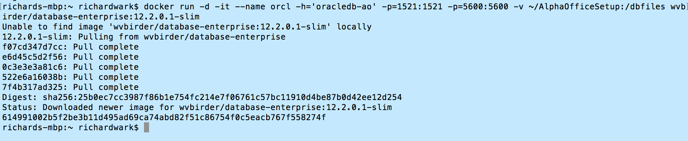

### **STEP 2**: Follow the progress of the creation

Once the container is instantiated, a default database is configured. Since we've indicated the `-it` flag on startup, we can follow the database creation progress using the docker logs command

- **Type** the following:

    ```
    docker logs --follow orcl
    ```

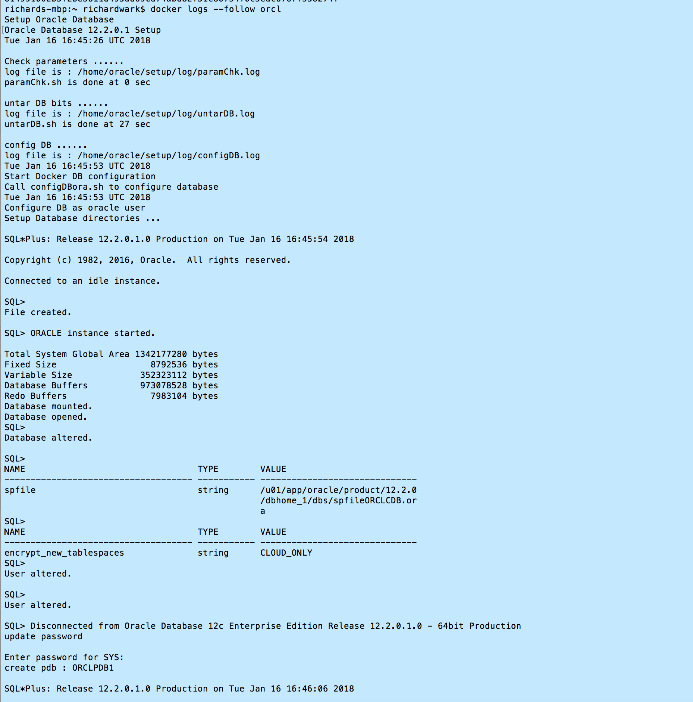

- When the database is created, you will see "**The database is ready for use**" in the log output:

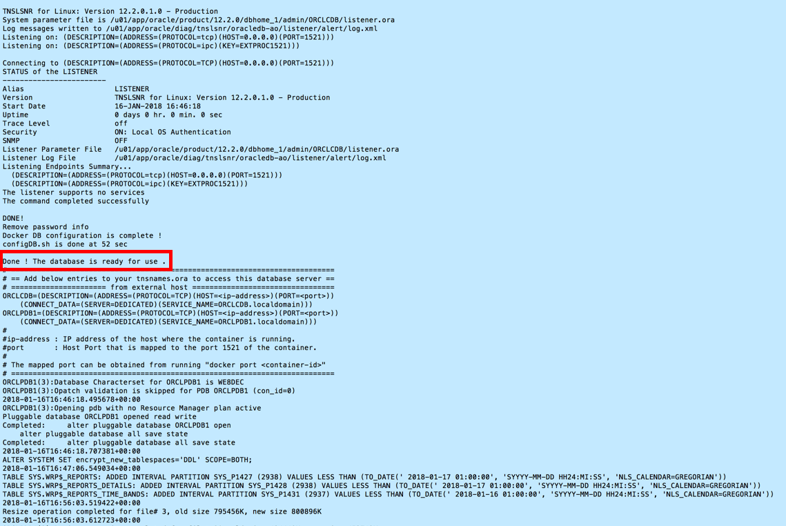

### **STEP 3**: Create and populate alpha schema

In this step we will connect into the database container and run a script to create the alpha schema user and populate the Product Catalog tables.

- **Type** the following:

    ```
    docker exec -it orcl bash
    ```

- Once into the container, you will see a prompt which includes the hostname you set in the docker run command. **Run the following commands** to verify your /dbfiles directory is writable:

    ```
    cd /dbfiles
    touch foo
    ls
    ```

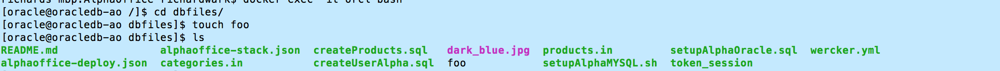

- If there are no permissions errors, the **foo** file should be present in the directory

### **STEP 4**: Use SQLPlus to run the script that sets up the database

- **Type** the following:

    ```
    sqlplus / as sysdba
    ```

- Once in SQLPLus **type** the following:

    ```
    @setupAlphaOracle.sql
    ```

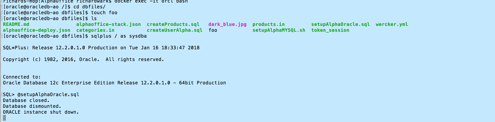

- After the script runs you should see a count of 57 and 20 records displayed. These are the records in the PRODUCTS and PRODUCT_CATEGORIES tables:

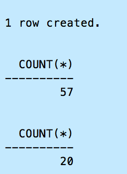

- **Type** the following:

    ```
    exit
    ```

- to go back to the HOST

### **STEP 5**: Verify container is running 

- **Type** the following:

    ```
    docker ps
    ```

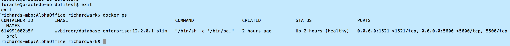

### **STEP 6**: Log into Enterprise Manager Express (**optional**)

Enterprise Manager Express comes bundled with the Oracle database you just created, which is running in a container. HTTP access as been defined on port 5600.

- Open a browser (in this example we are using Firefox). 
- **NOTE:** If you want to login to Enterprise Manager Express the browser needs the Shockwave add-on installed. Install this into your browser environment by going to the adobe website and downloading the player from: https://get.adobe.com/shockwave/
- ***If you are using the workshop VirtualBox VM Shockwave has already been installed and you will only have to enable it.***

- Go to URL: `http://localhost:5600/em` - You may get prompted to enable Adobe Flash. Click the link to do so. **Note**: based on your Mac configuration, you may need to replace localhost with your Mac's IP address.

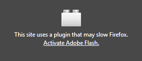

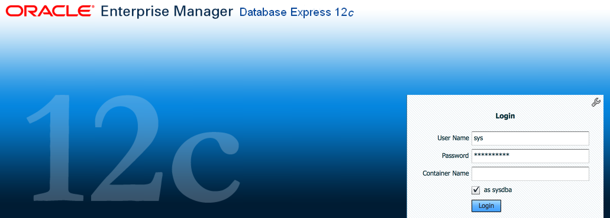

- Enter the following:

    ```
    Username: sys
    Password: Oradoc_db1
    Check the "as SYSDBA" checkbox
    ```

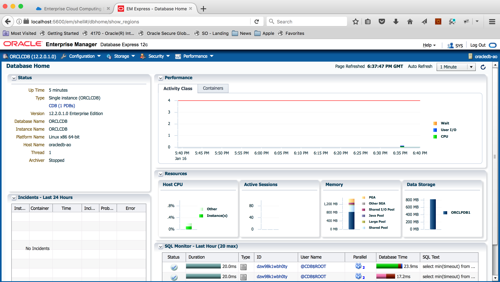

## MYSQL Database Setup

### **STEP 1**: Create the database container

This docker command will create a container based on the latest MYSQL database image file located in Docker Hub

- Let's take a look at what the docker **run** command options do:
    - "-d" flag runs the container in the background
    - "-it" flags instructs Docker to allocate a pseudo-TTY connected to the
    container’s stdin, creating an interactive bash capable shell in the container (which we will use in a moment when we connect into the container)
    - "-h" We give the container a hostname "mysqldb-ao" to make it easier to
    start/stop/remove, reference from other containers, etc
    - "-p" We map port 3306 to the same port on the HOST for accessibility from
    outside of the container's private subnet (typically 172.17.0.0/16). This allows the container to be accessed from the HOST, for example. The default port for MYSQL is on port 3306
    - "--name" The name of the container will be "mysql"
    - "-v" This maps the directory where you downloaded the AlphaOfficeSetup GIT
    repository to the /dbfiles directory within the container 

- **Type OR cut and paste** the following, but ***Substitute*** the **YOUR-HOME** place holder with the directory name where you loaded the AlphaofficeSetup GIT repository. For Example: `/YOUR-HOME/AlphaOfficeSetup` might change to this `~/AlphaOfficeSetup`, if you loaded the git repository in your home directory.

    ```
    docker run -d -it --name mysql -h='mysqldb-ao' -p=3306:3306 -v /YOUR-HOME/AlphaOfficeSetup:/dbfiles --env="MYSQL_ROOT_PASSWORD=Alpha2017_" mysql
    ```

- This sets up a default MYSQL database using the **root** database users password as `Alpha2017_`

- ***NOTE: If you make a mistake*** with the volume path to where you downloaded the AlphaOfficeSetup files, you can stop and remove the container once it's created and try again using the following commands. ***DON'T RUN THESE TWO COMMANDS UNLESS YOU'VE MADE AN ERROR***

    ```
    docker stop mysql
    docker rm mysql
    ```

- This will take a couple of minutes to download the image file (since it does not yet reside locally), extract the content and finally create and configure the default database

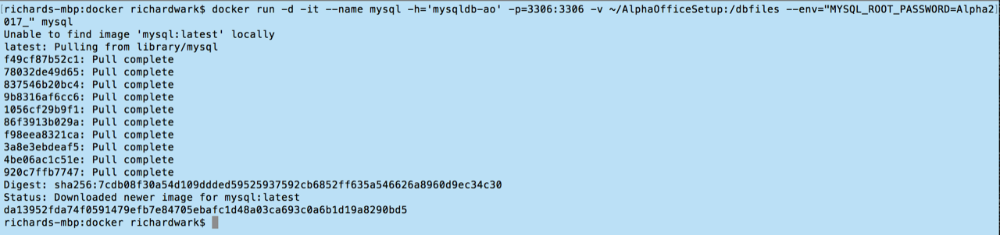

### **STEP 2**: Follow the progress of the creation

Once the container is instantiated, a default database is configured. Since we've indicated the `-it` flag on startup, we can follow the database creation progress using the docker logs command

- **Type** the following:

    ```
    docker logs --follow mysql
    ```

- When the database is created you will see "**Server hostname (bind-address): '*'; port: 3306**" in the log output:

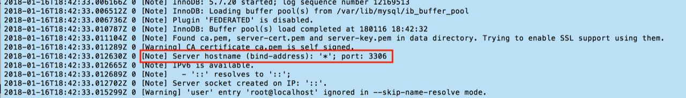

### **STEP 3**: Create and populate alpha schema

In this step we will connect into the database container and run a script to create the AlphaOfficeDB and then create the database user and populate the Product Catalog tables.

- **Type** the following:

    ```
    docker exec -it mysql bash
    ```

- Once into the container, you will see a prompt which includes the hostname you set in the docker run command. **Run the following commands** to verify your /dbfiles directory is writable:

    ```
    cd /dbfiles
    touch yyy
    ls
    ```

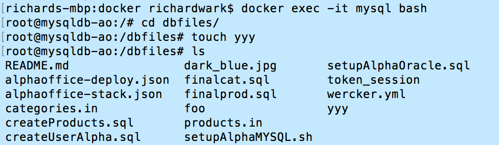

- If there are no permissions errors the **yyy** file should be present in the directory

### **STEP 4**: Run the script that sets up the database, user and tables

- **Type** the following:

    ```
    ./setupAlphaMYSQL.sh
    ```

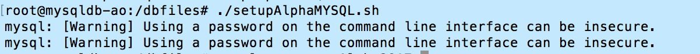

### **STEP 5**: Verify MYSQL tables

- **Type** the following to confirm the database tables were created and populated:

    ```
    mysql -uroot -pAlpha2017_
    use AlphaOfficeDB
    show tables;
    select count(*) from PRODUCTS;
    ```

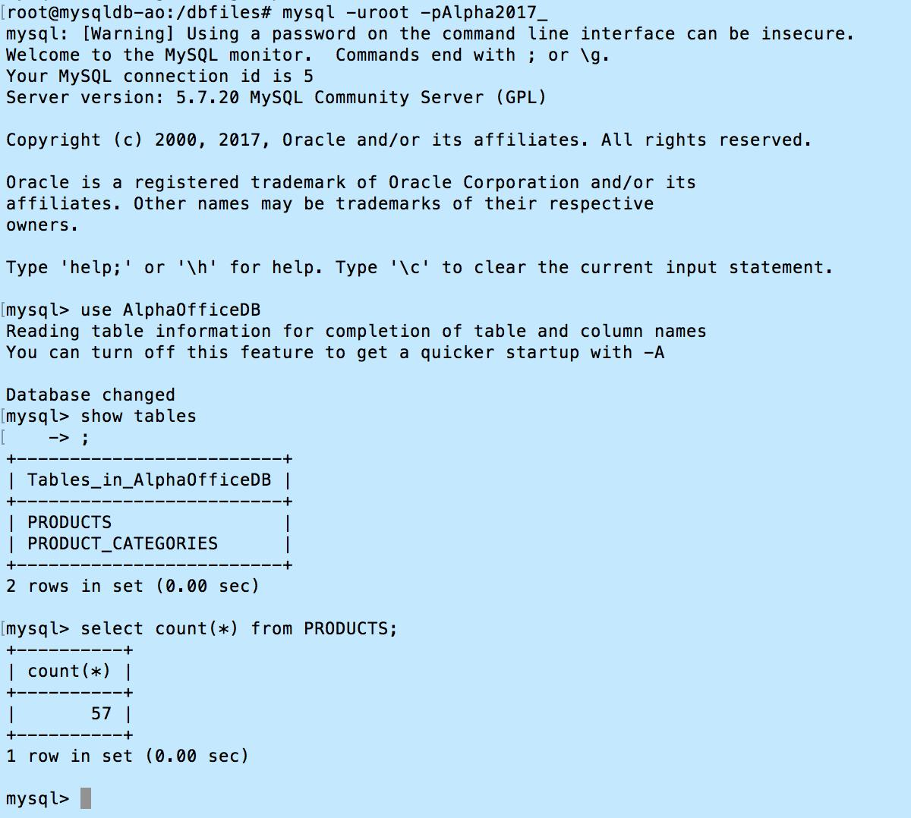

- You should see 57 records in the PRODUCTS table. 
- Enter "**exit, (TWICE)**`" to return to the HOST

### **STEP 6**: Verify that container is running

- **Type** the following:

    ```
    docker ps
    ```


# Deploy supporting AlphaOffice containers

In this section of the lab you will deploy the remaining containers to support the AlphaOffice application

- **TwitterFeed**: This **Java application** provides static Twitter posts (via a JSON file) via REST calls. The AlphaOffice UI makes calls to this container and associates the twitter posts to products displayed in the UI.
- **RESTClient**: This **Node.js** application makes REST calls to the selected datasource (Oracle or MYSQL) and returns details from the Product Catalog tables. Selection of the datasource is parameter driven.
- **AlphaOfficeUI**: **Node.js** application container that displays data obtained via the TwitterFeed and ClientREST containers. 

## Application Deployment

### **STEP 1**: Run and test the TwitterFeed

- **Type OR cut and paste** the following:

    ```
    docker run -d --name=twitterfeed -p=9080:9080 wvbirder/twitterfeed
    ```

This docker image will download the first time, extract and run the container.

- **Type** the following:

    ```
    docker ps
    ```

- splay all running containers. In this example the MYSQL database and the Twitterfeed containers are seen:

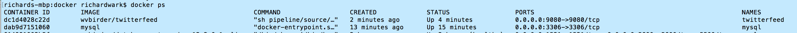

- Go to the browser, open up a new tab and **enter**:

    ```
    http://localhost:9080/statictweets
    ```

**NOTE:** The firefox browser included in the Linux VirtualBox VM has a built-in JSON formatter. If you don't have a JSON formatter add-on, you'll see a raw stream of text representing the tweets.

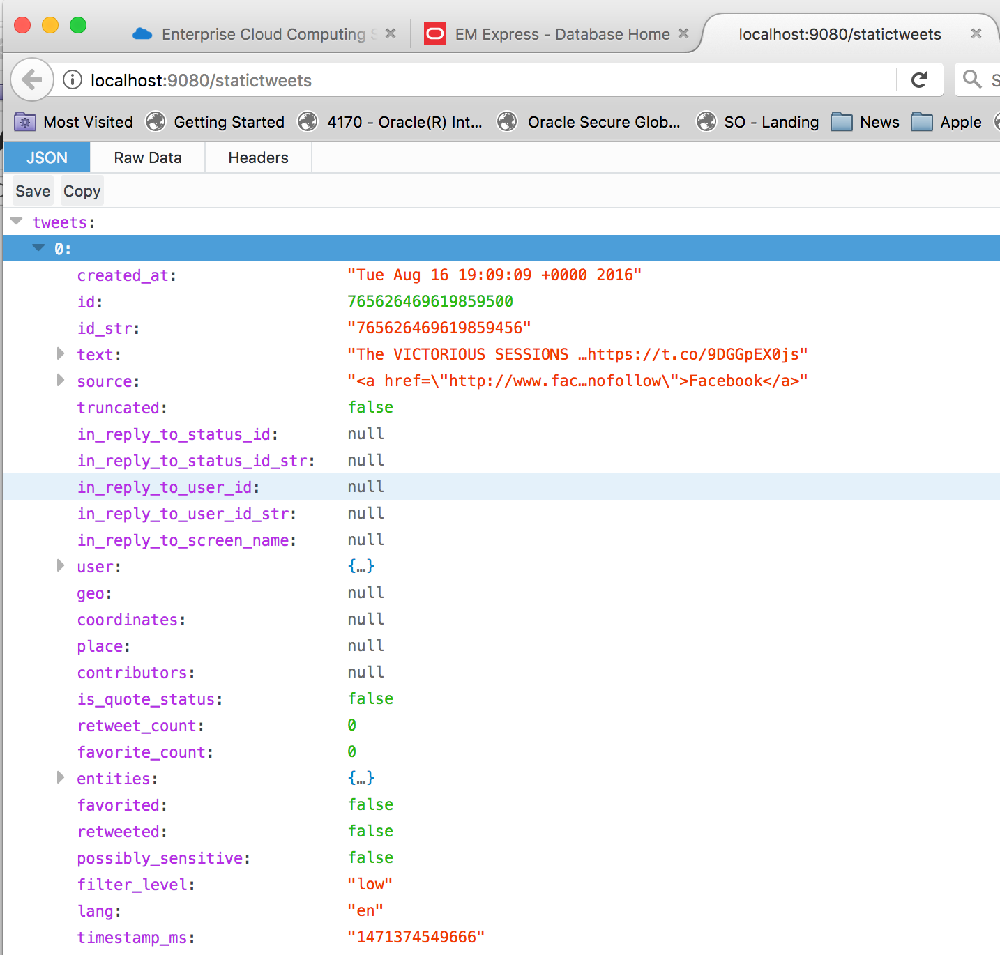

### **STEP 2**: Run and test the RESTClient

- Let's take a look at what the docker **run** command options do:
    - "-d" flag runs the container in the background
    - "-it" flags instructs Docker to allocate a pseudo-TTY connected to the
    container’s stdin, creating an interactive bash capable shell in the container (which we will use in a moment when we connect into the container)
    - "--rm" When this container is stopped all resources associated with it (storage, etc) will be deleted
    - "--name" The name of the container will be "restclient"
    - "-p" Port 8002 is mapped from the container to the same port on the HOST
    - "--link" A intra-container link to the "mysql" database is created using the
    - "mysqldb" hostname. This hostname is added to the restclient container's /etc/host file. Hostname is used because it is more flexible than using the private IP address of the container that can change upon subsquent invocations. The hostname is used for making a connection to the database 
    - "-e" Environment variables used by the application. "MYSQL_HOST" and "DS" settings designate the MYSQL datasource. The Oracle datsource uses the "ORACLE_CONNECT" variable (an example of that is shown below)

- ***NOTE: This example assumes we are using the MYSQL database as the datasource***. If you choose to use the Oracle database, then that command is in the **ALERT** shown below. **Type OR cut and paste**:

    ```
    docker stop restclient
    docker run -d -it --rm --name restclient -p=8002:8002 --link mysql:mysqldb-ao -e MYSQL_HOST='mysqldb-ao' -e DS='mysql' wvbirder/restclient
    ```

- ***ALERT: If you are using the Oracle database as the datasource the docker command would be:***

    ```
    docker stop restclient
    docker run -d -it --rm --name restclient -p=8002:8002 --link orcl:oracledb-ao -e ORACLE_CONNECT='oracledb-ao/orclpdb1.localdomain' -e DS='oracle' wvbirder/restclient
    ```

 - **Type** the following to display all the containers:

    ```
    docker ps
    ```
 
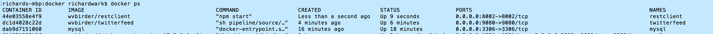

- Go to the browser, open up a new tab and **enter**:

    ```
    http://localhost:8002/products
    ```

- A list of ALL products are shown:

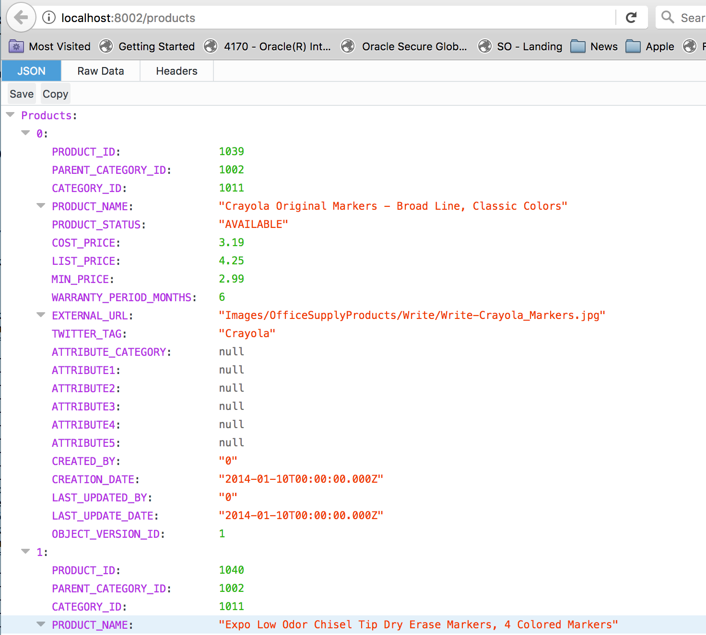

- You can also query an individual product. In the browser, open up a new tab and **enter**:

    ```
    http://localhost:8002/product/1025
    ```

- **NOTE:** In the URL that "**product**" is singular


**SIDEBAR:** If you don't want use a database as the datasource, you can always stop the current `restclient` and fall back to a version that uses a JSON file for the Products buy using: `docker run -d -it --rm --name restclient -p=8002:8002 -e DS='json' wvbirder/restclient`

**OPTONAL:** If you configured both ORACLE and MYSQL databases, then you can stop the `restclient` container after testing with one of the datasources by typing: `docker stop restclient`. Then, start another `restclient` container stipulating the new datasource using the appropriate commands already shown at the beginning of this step.

### **STEP 3**: Run and test the AlphaOfficeUI

- **Type OR cut and paste**:

    ```
    docker run -d --name=alphaofficeui -p=8085:8085 wvbirder/alpha-office-catalog-ui
    ```

- After it is running, test the completed application deployment by going to the browser, and opening a new tab:

```
http://localhost:8085
```

- You should see something like:

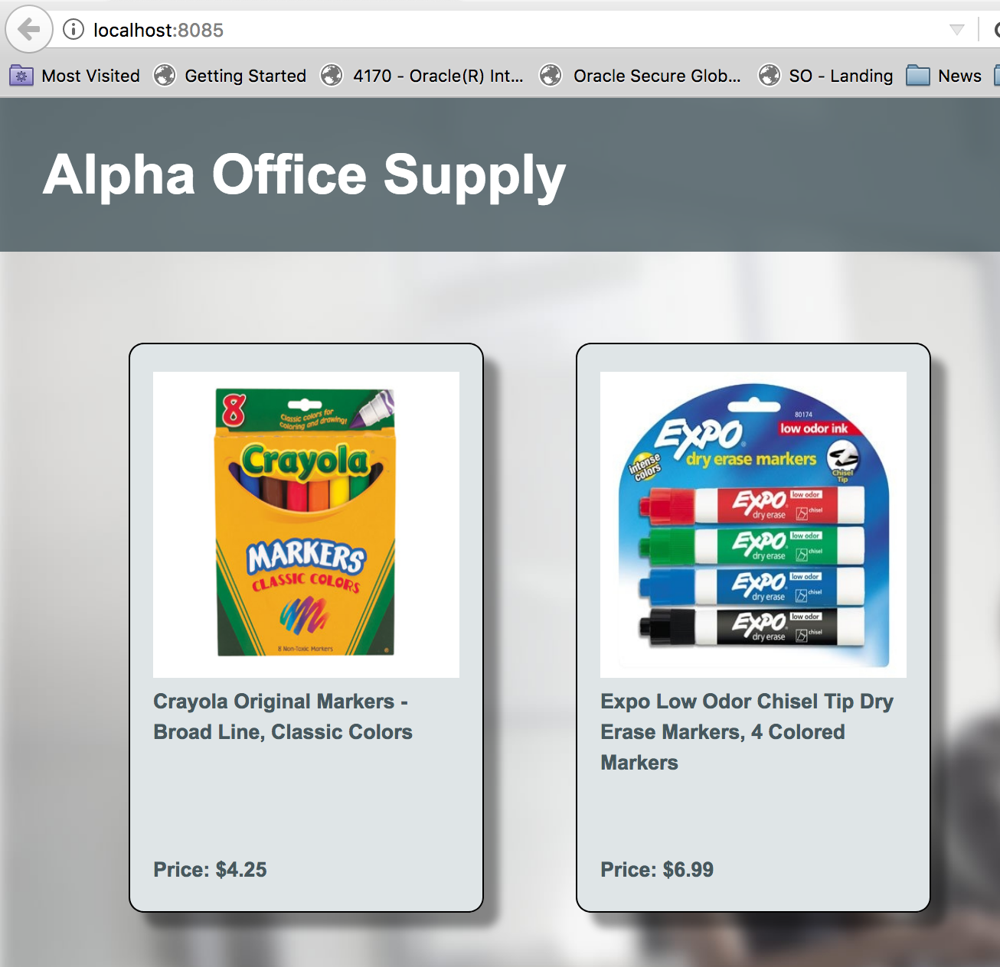

- Clicking on one of the products brings up details for that item with its associated Twitter comments.

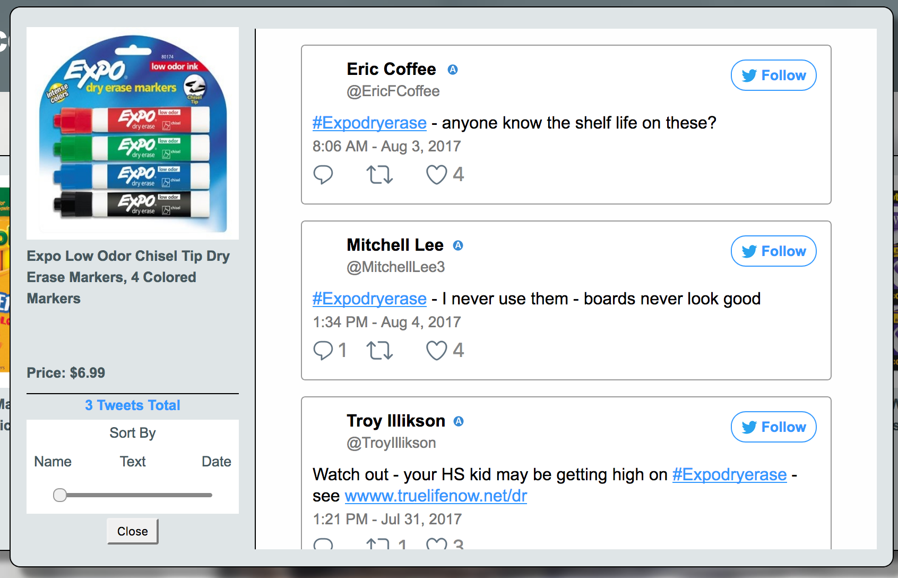

# Make changes to the AlphaOffice application

In this section you will make a couple of changes to the AlphaOfficeUI application. One will correct a typo and another will change the background image. The flow for this will be as follows:

- Copy the new background image into the container
- Connect into the AlphaOfficeUI container
- install the vim text editor
- Fix a typo and specify the new background image
- Save (docker commit) a copy of the changes to a NEW docker image
- Start up and test another AlphaOfficeUI container using the NEW image
- Push the NEW image to your personal Docker Hub account

## Container in-place modifications

### **STEP 1**: Copy a new Background Image

Copy a background image file into the running AlphaOfficeUI container. This file is in your YOUR_HOME/AlphaOfficeSetup directory that you GIT cloned at the beginning of the lab

- **Type** the following (substituting YOUR-HOME):

    ```
    docker cp YOUR_HOME/AlphaOfficeSetup/dark_blue.jpg alphaofficeui:/pipeline/source/public/Images
    ```

### **STEP 2**: Install the VIM editor in the container

- Even though the original AlphaOfficeUI image could have been set up ahead of time with any needed client tools, we're adding the the environment on-the-fly to give you some idea that it can be done

- Connect into the "alphaofficeui" container:

    ```
    docker exec -it alphaofficeui bash
    ```

- **Type** the following:

    ```
    apt-get update
    ```

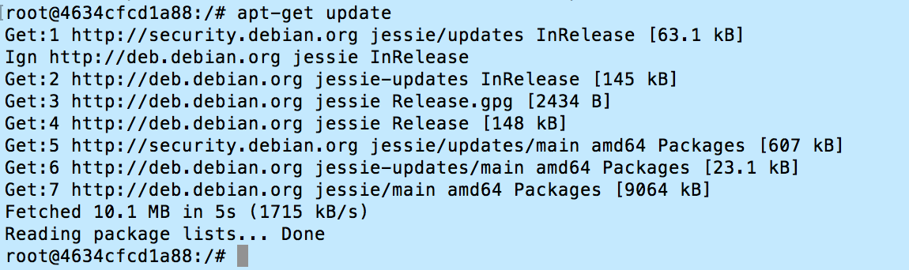

- Type:
    ```
    apt-get install vim
    ```

- Enter `Y` at the "Do you want to continue?" prompt.

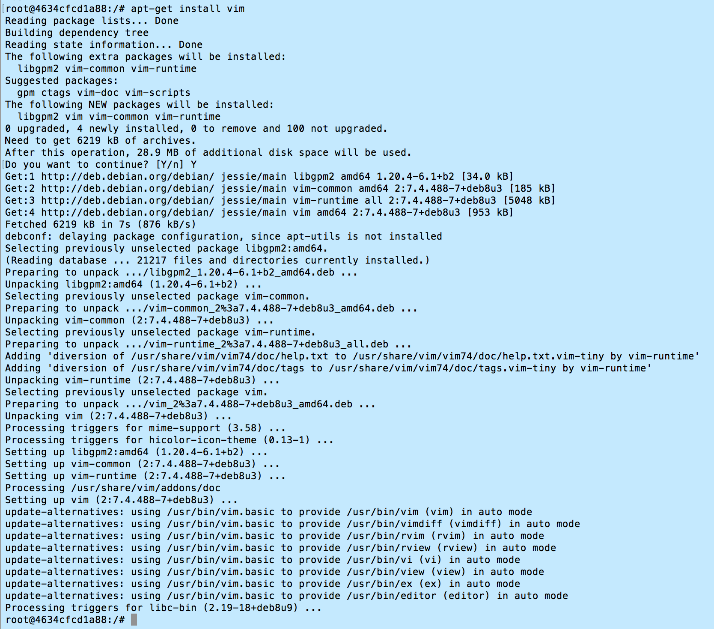

- Verify the "**dark_blue.jpg**" file is in the container by typing:

    ```
    ls /pipeline/source/public/Images
    ```

### **STEP 3**: Edit the alpha.html file   

- Edit the "alpha.html" file to fix a typo - Note, if you are unfamiliar with `vim`, you'll find information at this URL: [VIM](http://vimsheet.com). The commands are very similar to vi:

    ```
    vim /pipeline/source/public/alpha.html
    ```

- Fix the header title to read "**Alpha Office Product Listing**". You can also change the body title to whatever you want:

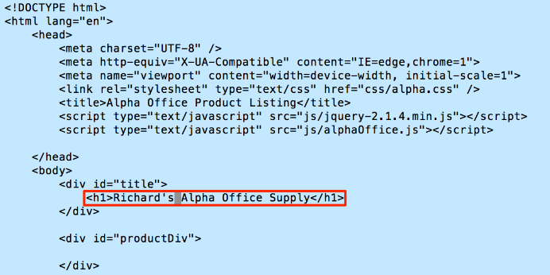

- Save the file and exit by hitting the **ESC** key and then holding the **SHIFT** key down and typing "**Z**" TWICE

### **STEP 4**: Edit the alpha.ccs file

- **Type** the following:

    ```
    vim /pipeline/source/public/css/alpha.css
    ```

- Change the background image reference to "**dark_blue.jpg**"

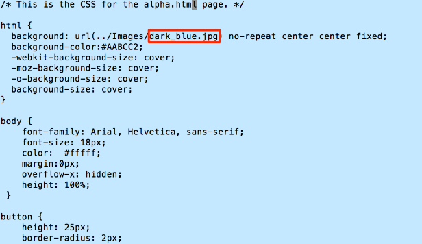

- Save the file and exit by hitting the **ESC** key and then holding the **SHIFT** key down and typing "**Z**" TWICE

- **Exit** out of the container:

    ```
    exit
    ```

# Commit and run the NEW version of AlphaOffice

## Test modified Application

### **STEP 1**: Commit a NEW Docker image

In this step you will save a copy of your modifed docker container and give it a new name. You're back out in the HOST now. Substitute your docker hub account name where asked for in the following commands. For example: `docker commit alphaofficeui wvbirder/alphaoffice-new`:

- **Type** the following:

    ```
    docker commit alphaofficeui (your-dockerhub-account)/(image-name)
    ```

- **Type** the following to see the new saved image:

    ```
    docker images
    ```

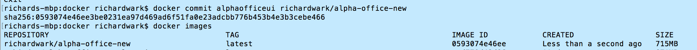

### **STEP 2**: Start a container based on your new image

Since there is already a running `alphaofficeui` container we'll name the new container `alphaofficeui2` and use port 8086 on the HOST since 8085 is in use

- **Type** the following:

    ```
    docker run -d --name=alphaofficeui2 -p=8086:8085 (your-dockerhub-account)/(image-name)
    ```

- Verify the new container is running:

    ```
    docker ps
    ```

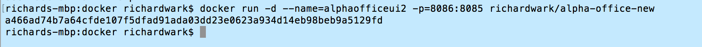

- Open up a new browser tab and enter:

    ```
    http://localhost:8086
    ```

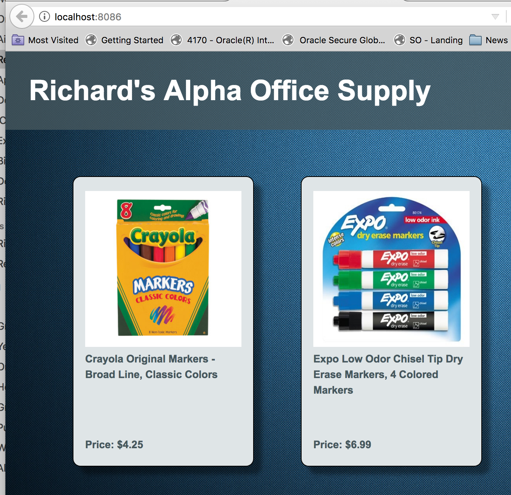

### **STEP 3**: Push the new image to your docker hub account

Now others will be able to take advantage of the changes you made to the application. In this example "wvbirder" is the Docker Hub account name, but you will be using your own account

- **Type** the following:

    ```
    docker push (your-dockerhub-account)/(image-name)
    ```

- Example:

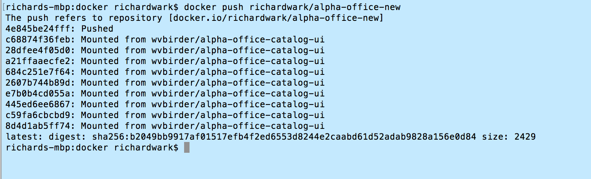

- Once the push is completed you can log into your Docker Hub account and verify it is there:

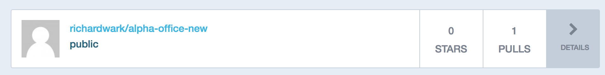

**This completes the Lab!**
