Updated: February 5, 2018

## Introduction

This pre-work for the Docker labs on Mac allows you to get a working environment configured running on your mac.  
  - This should have very little impact to your working mac
  - It does add a service by default, but it can be disabled
  - Version installed in this setup guide is 17.12 CE - stable
  - If you don't want to run Docker natively on your mac, you can select another option (linux in the cloud or a VM running in Vbox or another virtualization engine)     

Please direct comments to: Matthew.Orsie@oracle.com or Richard.Wark@oracle.com

## Objectives

- Download Docker 
- Install docker
    - Follow installation prompts
    - Log in with your docker credentials (or create them)
    - Do simple validation

## Required Artifacts

- Internet connection 
- Docker Hub Account
- Apple Mac with Admin rights

# Start up and login into your Mac environment

If you want to use your own Mac then login (we assume you already are) and open a terminal window.

## Installation

### **STEP 1**: Open up your browsers

- Navigate to http://docker.com and select downloads.

- Select **Docker CE** for Macx

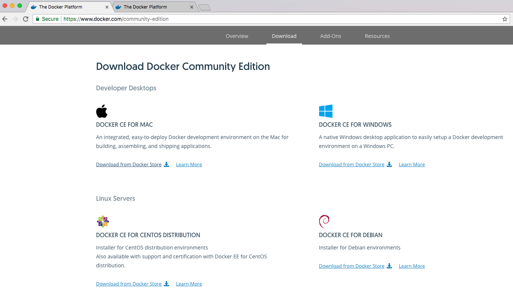

- The Disk image should download to your downloads folder

The information on your docker engine should be displayed:

### **STEP 2**: Download the Mac package

- Select "**Get Docker**" from button on right:

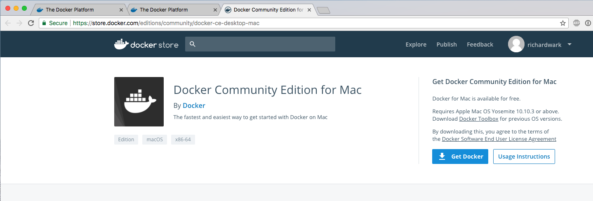

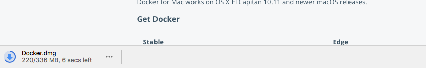

### **STEP 3**: Launch the downloaded package ()

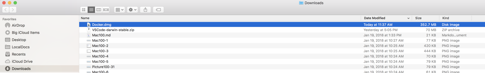

you should see:

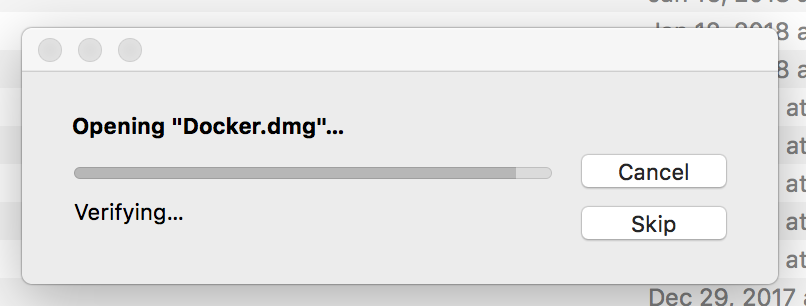

### **STEP 5**: Install Docker Application:

- Simply drag the Docker Icon into Applications folder as shown.

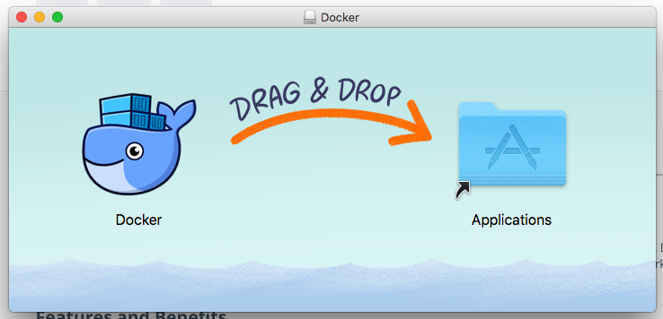

- Provide your password as requested:

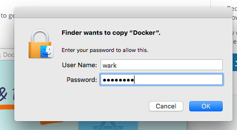

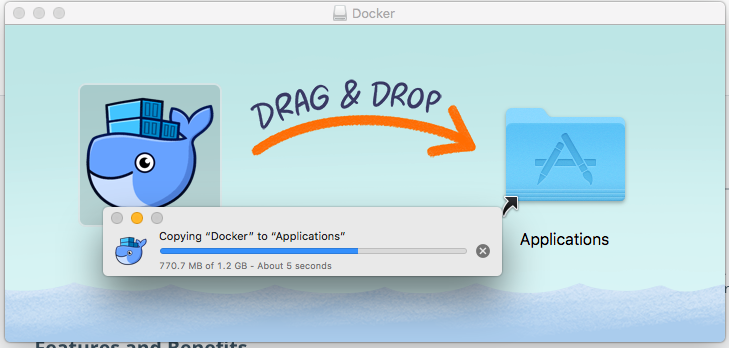

### **STEP 6**: You should now see Docker in your Applications folder as well as your Menu-bar

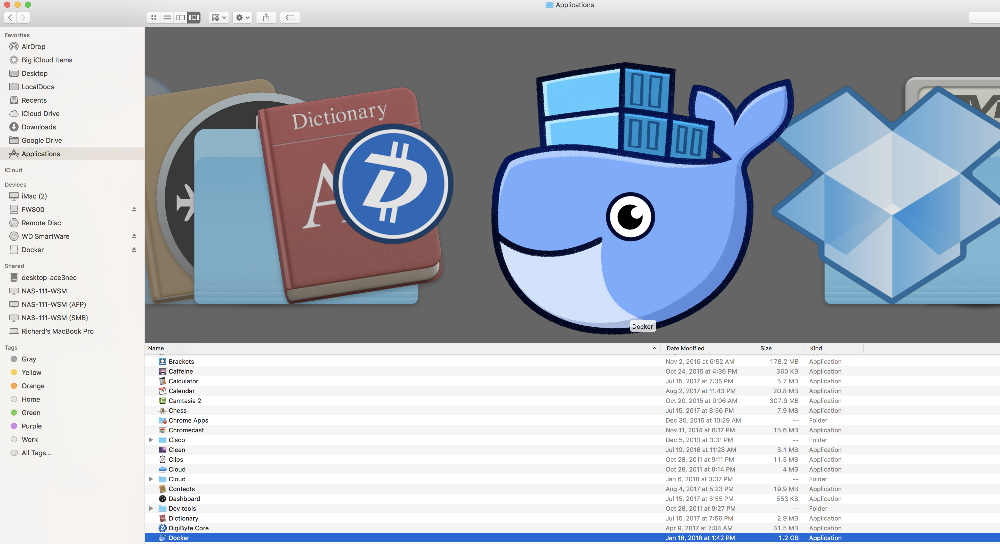

- Launch the application and confirm you're comfortable running it (open):

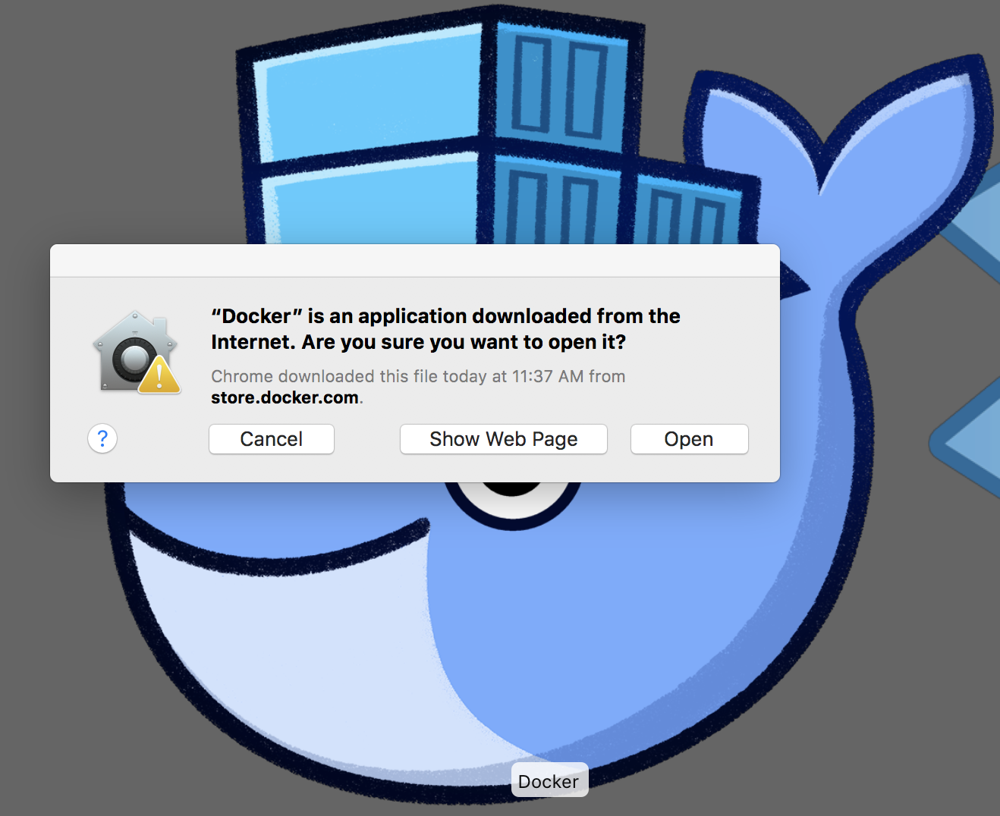

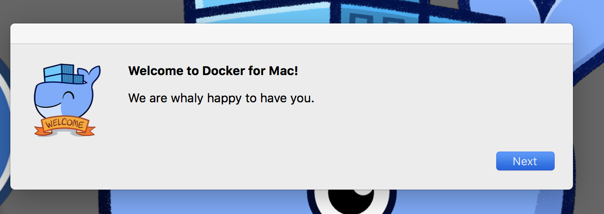

- Provide the admin password to complete the setup.  This is required as the Docker Engine runs as a service.

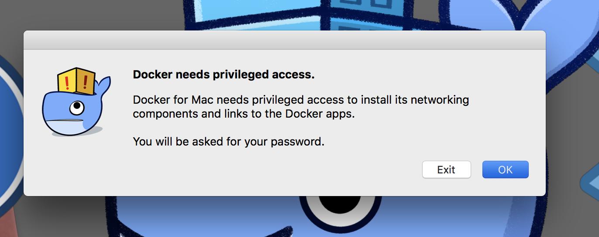

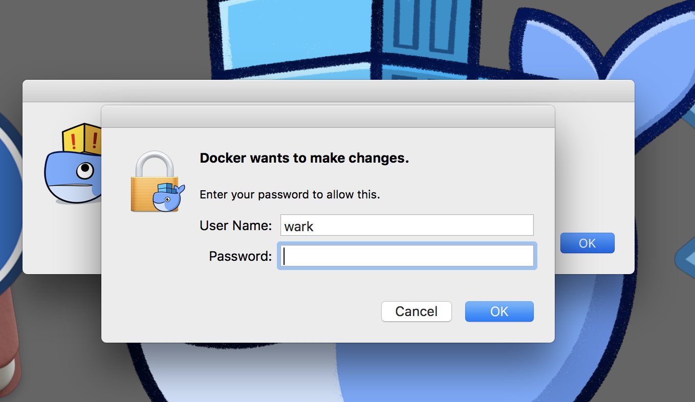

### **STEP 6**: You can confirm that docker has started, you should set the green light: 

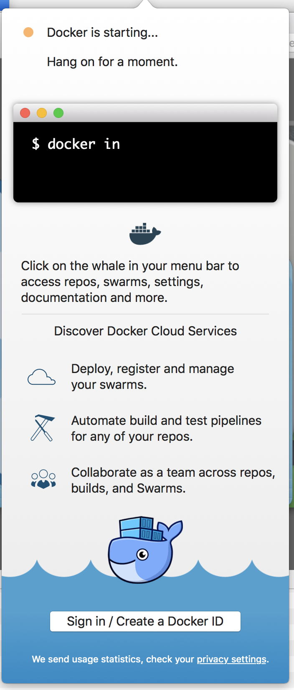

This will be the message you see after the engine has started (note: it may take 1-2 mins to start completely)

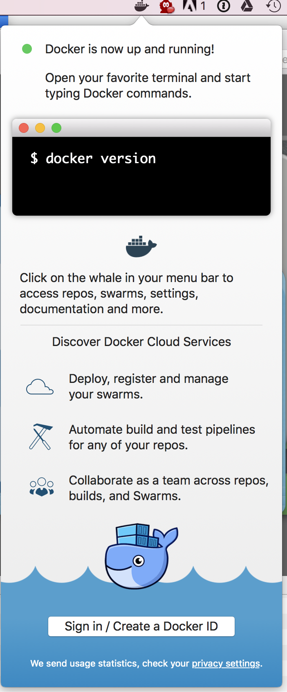

### **STEP 7**: Log into Docker with Your DockerID and password:

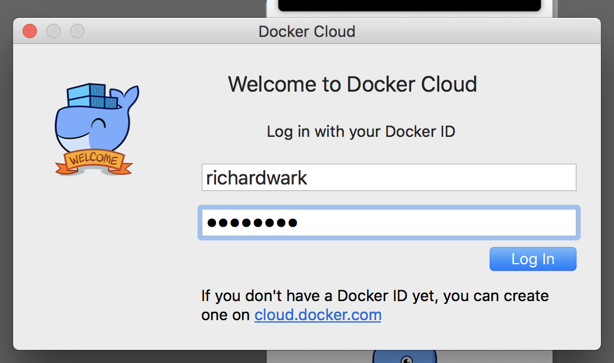

### **STEP 8**: Confirm you username in the menu bar with a right-click.

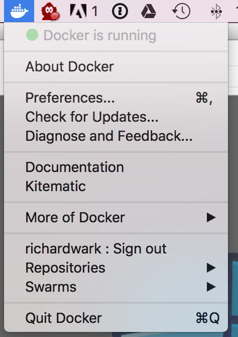

You should now be prepared to complete Lab 100.

**This completes the Setup for the Docker Labs!**
