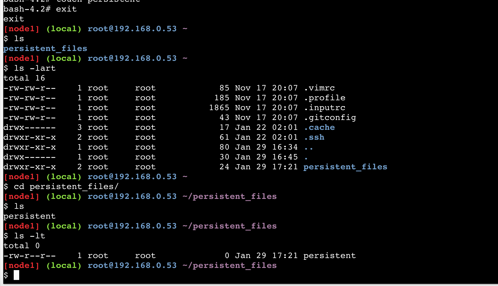

# Docker Workshop

 

Updated: January 30, 2018

## Introduction

In this lab we introduce some basic concepts of Docker, container architectures and functions.  We will do this using a single container which provides a REST service as part of a node.js application.  The application has two pieces, which provide a microservice.

- Datasource: a simple JSON file included in the container
- REST Client: To serve up data from the datasource

You will use various Docker commands to setup, run and connect into containers. In this introduction you will explore concepts of Docker volumes, networking and container architecture.

Please direct comments to: Matthew.Orsie@oracle.com or Richard.Wark@oracle.com

## Objectives

- Deploy and test a simple docker container running a simple application
- Introduce and use the Dockerhub registry
- Familiarize yourself with Docker commands (ps, run, exec)
- Understand foundational concepts of container networking and filesystem mapping

## Required Artifacts

- Docker Hub Account
- A machine with browser and internet access

# Start up and login into your machine

## Verify Docker Play session availability & Installation

### **STEP 1**: Open up a Browser Window

- You can use whichever browser you have on your machine to connect to: `https://labs.play-with-docker.com/`


### **STEP 2**: Create a new instance

- Press **"start"** and then **add new instance** (under the blue box )to create a new Sandbox.  This essentially becomes your terminal to the Operating System


- Type:

    ```
    cd
    docker version
    ```

- The information on your docker engine should be displayed:


### **STEP 3**: See What is running

Let's take a quick look at what is running in the docker engine, if this is a new environment, you should see no docker images running.

- Type:

    ```
    docker ps
    ```


### **STEP 4**: Run the restclient docker image from docker hub

Here, we will download and run an existing docker image which was created so that it will run with as a stand-alone application.  It uses a JSON formatted datafile to serve the test data via it's exposed REST service.

- Let's take a look at what the docker **run** command options do:
    - "-d" flag runs the container in the background
    - "-it" flags instructs Docker to allocate a pseudo-TTY connected to the
    container’s stdin, creating an interactive bash capable shell in the container (which we will use in a moment when we connect into the container)
    - "--rm" When this container is stopped all resources associated with it (storage, etc) will be deleted
    - "--name" The name of the container will be "restclient"
    - "-p" Port 8002 is mapped from the container to port 8002 on the HOST
    - "-e" Environment variables used by the application. "DS" setting designates the JSON datasource.

- Type (all on one line):

    ```
    docker run -d -it --rm --name restclient -p=8002:8002 -v /root/persistent_files:/pfile-e DS='json' wvbirder/restclient
    ```

- Note here that the -v specified the mapping of the container's filesystem to a location on the docker host machine. Then run the command:


### **STEP 5**: Check the environment's current containers

- Again using the "**docker ps**" command, we should see our newly spawned docker container, the REST client container

- Type:

    ```
    docker ps
    ```


- Notice the CONTAINER_ID on the far left, time created, ports - container id is unique. There, we see the running container and the ports it's using both internally an on the host, both 8002 in this case.

### **STEP 6**: Check the Application with a browser

- In the browser, above the terminal display, you should see the exposed port, 8002: Click there:


- Now add, "**/products**" to that URL (after the play-with-docker)

[](images/100Pwd/Picture100-11.png)

### **STEP 7**: Run on (redirect) another host port

- Now, let's start the image using the hosts 18002 port:

    ```
    docker run -d -it --rm --name restclient -p=18002:8002 -e DS='json' wvbirder/restclient
    ```


- If you change your browsers port to 18002, you can now see that localhost is using 18002 and redirecting that to our container's port 8002 as shown in the "-p" mapping




**This completes the Lab!**
