# Docker Workshop

 

Updated: February 14, 2018

## Overview

What is Docker? What is a container?

- Docker is the company and containerization technology.
- [Docker Documentation](https://docs.docker.com)
- A container is a runtime instance of a docker image: [Container Documentation](https://docs.docker.com/glossary/?term=container)

Containers have been around for many years. Docker created a technology that was usable by mere humans, and was much easier to understand than before. Thus, has enjoyed a tremendous amount of support for creating a technology for packaging applications to be portable and lightweight.

### VM vs Container


While containers may sound like a virtual machine (VM), the two are distinct technologies. With VMs each virtual machine includes the application, the necessary binaries and libraries and the entire guest operating system.

Whereas, Containers include the application, all of its dependencies, but share the kernel with other containers and are not tied to any specific infrastructure, other than having the Docker engine installed on it’s host – allowing containers to run on almost any computer, infrastructure and cloud.

**Note:** At this time, Windows and Linux containers require that they run on their respective kernel base, therefore, Windows containers cannot run on Linux hosts and vice versa.

## Introduction

In this lab we introduce some basic concepts of Docker, container architectures and functions.  We will do this using a single container which provides a REST service as part of a node.js application.  The application has two pieces, which provide a microservice.

- Datasource: a simple JSON file included in the container
- REST Client: To serve up data from the datasource

You will use various Docker commands to setup, run and connect into containers. In this introduction you will explore concepts of Docker volumes, networking and container architecture.

***To log issues***, click here to go to the [github oracle](https://github.com/oracle/learning-library/issues/new) repository issue submission form.

## Objectives

- Deploy and test a simple docker container running a simple application
- Introduce and use the Dockerhub registry
- Familiarize yourself with Docker commands (ps, run, exec)
- Understand foundational concepts of container networking and filesystem mapping

## Required Artifacts

- Docker Hub Account
- A machine with browser and internet access

# Start up and login into your machine

## Verify Docker Play session availability & Installation

### **STEP 1**: Open up a Browser Window

- You can use whichever browser you have on your machine to connect to: `https://labs.play-with-docker.com/`

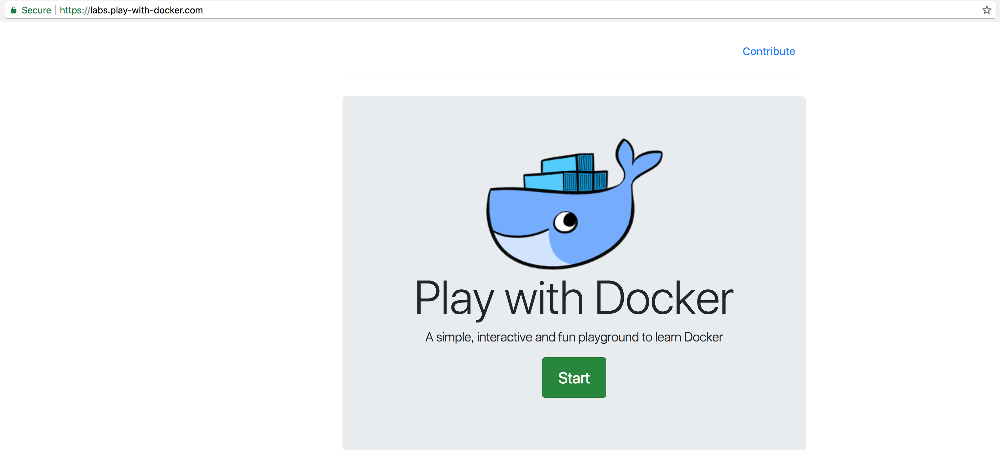

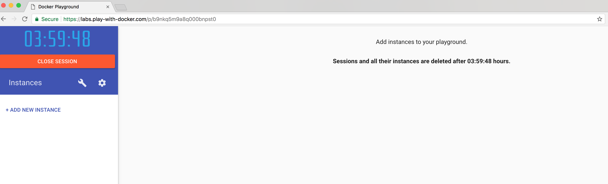

### **STEP 2**: Create a new instance

- Press **"start"** and then **add new instance** (under the blue box )to create a new Sandbox.  This essentially becomes your terminal to the Operating System

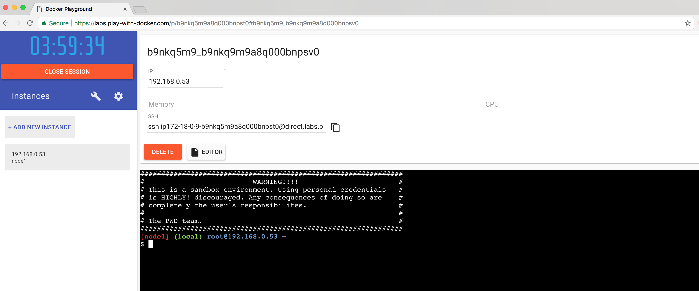

- **Type** the following:

    ```
    cd
    docker version
    ```

- The information on your docker engine should be displayed:

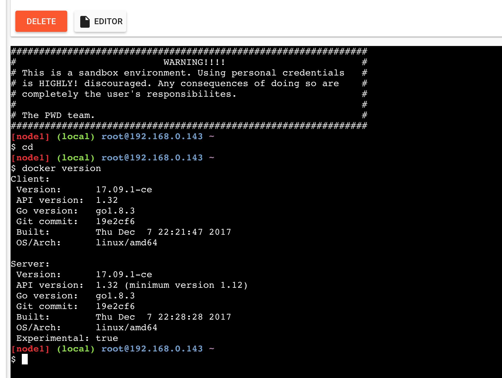

### **STEP 3**: See What is running

Let's take a quick look at what is running in the docker engine, if this is a new environment, you should see no docker images running.

- **Type** the following:

    ```
    docker ps
    ```

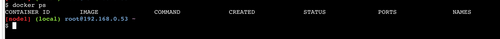

### **STEP 4**: Run the restclient docker image from docker hub

- Here, we will download and run an existing docker image which was created so that it will run with as a stand-alone application.  It uses a JSON formatted datafile to serve the test data via it's exposed REST service.

- Let's take a look at what the docker **run** command options do:
    - "-d" flag runs the container in the background
    - "-it" flags instructs Docker to allocate a pseudo-TTY connected to the
    container’s stdin, creating an interactive bash capable shell in the container (which we will use in a moment when we connect into the container)
    - "--rm" When this container is stopped all resources associated with it (storage, etc) will be deleted
    - "--name" The name of the container will be "restclient"
    - "-p" Port 8002 is mapped from the container to port 8002 on the HOST
    - "-e" Environment variables used by the application. "DS" setting designates the JSON datasource.

- **Type** the following (all on one line):

    ```
    docker run -d -it --rm --name restclient -p=8002:8002 -v /root/persistent_files:/pfile-e DS='json' wvbirder/restclient
    ```

- Note here that the -v specified the mapping of the container's file system to a location on the docker host machine. Then run the command:

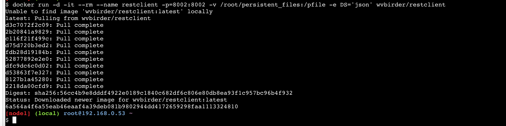

### **STEP 5**: Check the environment's current containers

- Again using the "**docker ps**" command, we should see our newly spawned docker container, the REST client container

- **Type** the following:

    ```
    docker ps
    ```

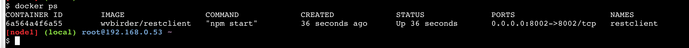

- Notice the CONTAINER_ID on the far left, time created, ports - container id is unique. There, we see the running container and the ports it's using both internally an on the host, both 8002 in this case.

### **STEP 6**: Check the Application with a browser

- In the browser, above the terminal display, you should see the exposed port, 8002: **Click the port**

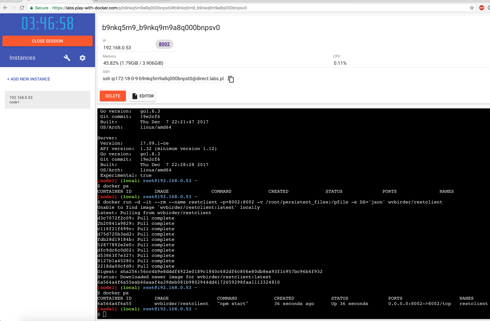

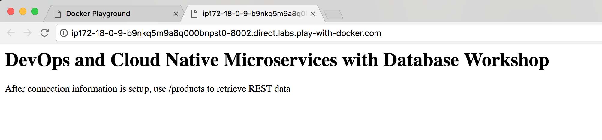


- Now add, "**/products**" to that URL (after the play-with-docker). A JSON list of products should be displayed.

[](images/100Pwd/Picture100-11.png)

### **STEP 7**: Run on (redirect) another host port

- Now, let's start another container using the Host's 18002 port:

- **Type** the following:

    ```
    docker run -d -it --rm --name restclient -p=18002:8002 -e DS='json' wvbirder/restclient
    ```

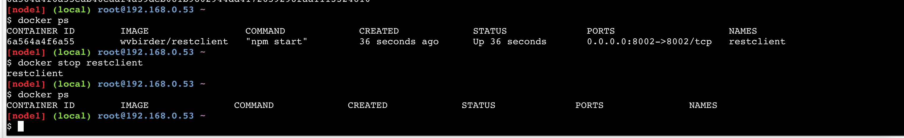

- If you change your browsers port to 18002, you will see that the Host server is using 18002 and mapping that to our container's port 8002.

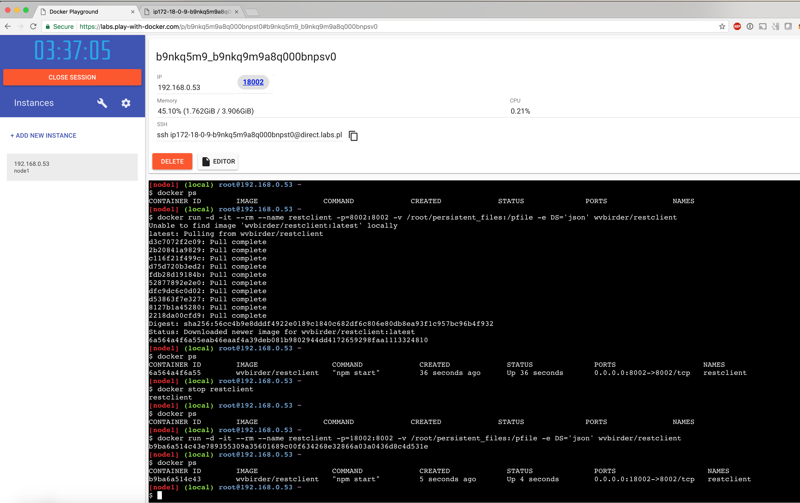

### **STEP 8**: Inspect the Container's Network and IP Address

- You can get various bits of information of the subnet that docker container is running on by inspecting the default network bridge docker creates out-of-the-box. You can create your own networks and assign containers to them but that is out of the scope of this lab. 

 - **Type** the following:

```
docker network inspect bridge
```

- This returns information about all the containers running on the default bridge. We see that our "restclient" container is assigned IP Address 172.17.0.2. You can also ping that address from the Host server.

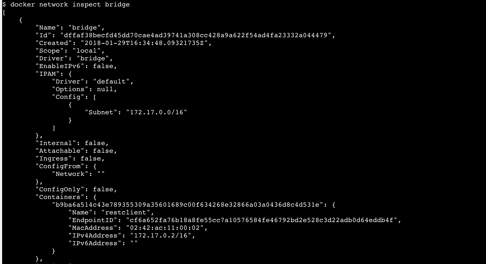

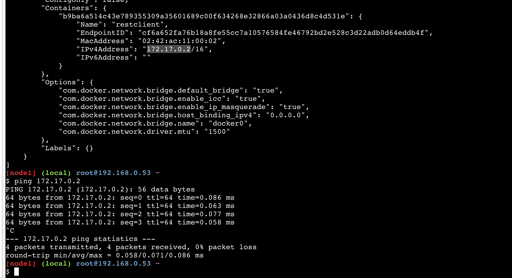

- Ping the restclient container IP Address: (in this example the IP was 172.17.0.2)

- **Type** the following:

```
ping 172.17.0.2
```

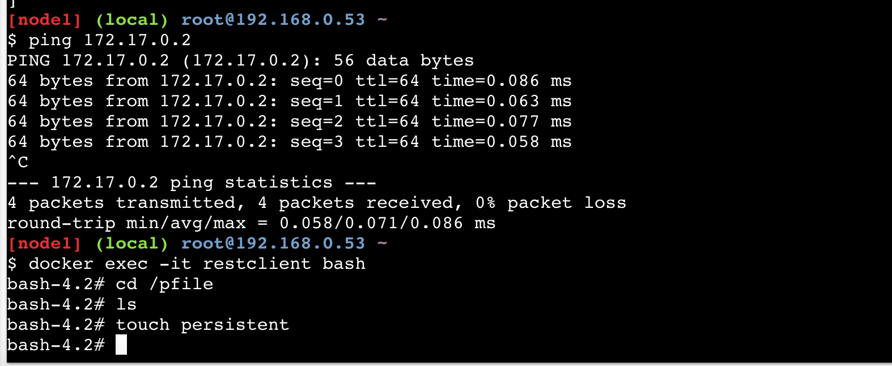

**This completes the Lab!**
