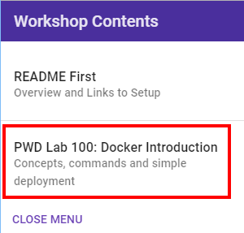

# Workshop Overview (Play-with-Docker) 

## Overview

This Docker workshop will walk you through using common docker commands, download docker images, creating containers and deploying a full blown application. The first Lab starts by examining a docker environment and deploying a simple application UI (AlphaOffice). The second Lab expands on functionality by deploying and configuring a database of your choice (Oracle or MYSQL), creating a user and populating the user schema. Next, it has you deploy various supporting components of the AlphaOffice application (TwitterFeed, RESTClient that communicates to the database you configure, and the AlphaOffcieUI Node.js application). Finally in Lab 200 you will modify the UI container, save a new version and test your changes.

- All setup steps and lab replays have been posted on [youtube](https://www.youtube.com/playlist?list=PLPIzp-E1msrYGLKIgW3njO3uUkvXD0bAH). You can watch the videos to gain an overview of the workshop and what's required to successfully complete the labs.

# Workshop Prerequisites 

***NOTE: Play-with-Docker will only let you do Lab 100***

## Obtain a Docker Account (Optional for using Play-with-Docker)

### **Step 1**: Obtain a Docker Account

- If you do not have a Docker Hub account please go to [Docker Hub](https://hub.docker.com/), fill out the fiels illustrated below and press signup.

### **STEP 2**: Begin Lab 100

- Click on the hamburger menu in the top left corner of the webpage.

    

- Select Lab 100 and begin the workshop.

    
