# Workshop Overview (Mac) 

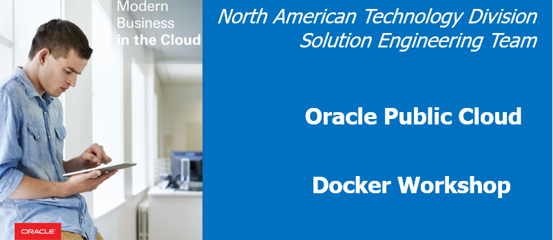

## Overview

This Docker workshop will walk you through using common docker commands, download docker images, creating containers and deploying a full blown application. The first Lab starts by examining a docker environment and deploying a simple application UI (AlphaOffice). The second Lab expands on functionality by deploying and configuring a database of your choice (Oracle or MYSQL), creating a user and populating the user schema. Next, it has you deploy various supporting components of the AlphaOffice application (TwitterFeed, RESTClient that communicates to the database you configure, and the AlphaOffcieUI Node.js application). Finally in Lab 200 you will modify the UI container, save a new version and test your changes.

- All setup steps and lab replays have been posted on [youtube](https://www.youtube.com/playlist?list=PLPIzp-E1msrYGLKIgW3njO3uUkvXD0bAH). You can watch the videos to gain an overview of the workshop and what's required to successfully complete the labs.

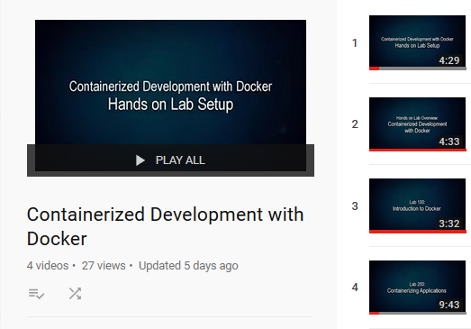

# Workshop Prerequisites 

This workshop requires some client software to be installed either on your laptop, or inside a virtual box image. Before begining please determine the best path for your circumstance.

## _Option 1: Virtual Box Setup_

### **Step 1**: Obtain a Docker Account

- If you do not have a Docker Hub account please go to [Docker Hub](https://hub.docker.com/), fill out the fiels illustrated below and press signup.

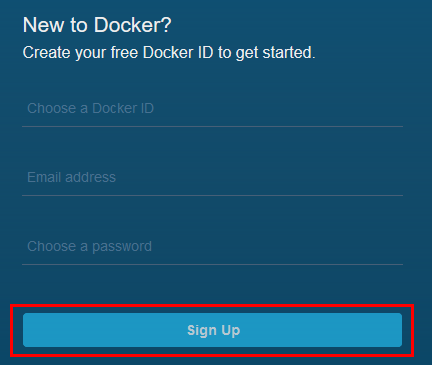

### **Step 2**: Check Hardware Requirements

- You will need a machine capable of running the workshop image within Oracle Virtual Box (MAC or PC / Minumum of 20GB of free storage / 8GB RAM)
- You will need full Administrator privileges on your machines, and in some cases will may need to turn on Hardware Virtualization in the BIOS.
    - Hardware Virtualization needs to be enabled in the BIOS to properly run Virtual Box.  If you get virtualization errors, reboot into the BIOS and make sure that the setting to enable Hardware Virtualization is enabled. 

- The latest version of Virtual Box should be installed and tested prior to the workhop.

### **STEP 3**: Install Virtual Box and Download VM

- [Download](https://www.virtualbox.org/wiki/Downloads) and install Virtual box 
- Download all 7 parts of the workshop Linux VM into the same directory: [Location of Virtual box OVA](https://publicdocs-corp.documents.us2.oraclecloud.com/documents/link/LF3AECCFE80C8B381E41E491F6C3FF17C1177E4725F3/folder/F81AC36043787ED102DC77DDF6C3FF17C1177E4725F3/_Docker_VM)

    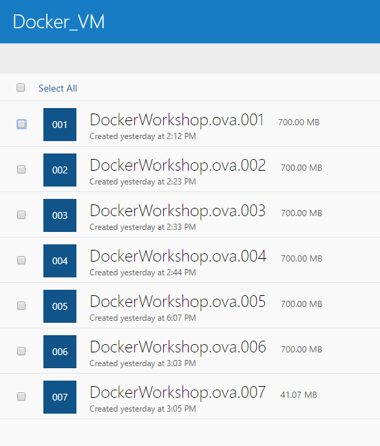

### **STEP 4**: Download and install 7-zip and Extract OVA file

You will use 7-zip to reassemble the 7 part file. It will extract an OVF and VMDK file

- [Download](http://www.7-zip.org/download.html) and install 7-zip
- Run 7-zip and browse to the directory when you downloaded the multi-part file. **Select** the FIRST part and click **Extract**;

    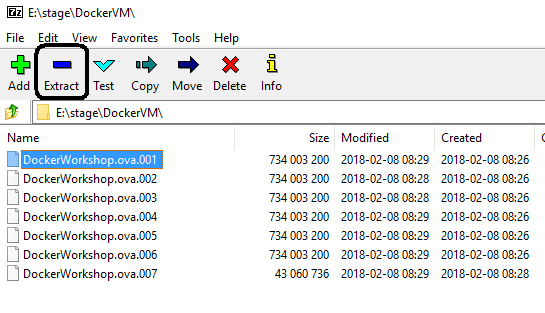

- Then click **OK**:

    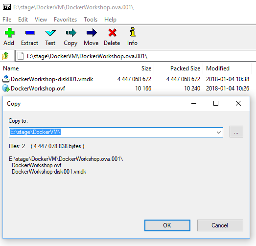

### **STEP 5**: Import OVF File

- Startup **Oracle Virtual Box**

    

- From top left menu select **File -> Import Appliance**

    

- Click on **browse** icon to select file to import.

- Navigate to the **DockerWorkshop.ovf** file, select it, and click **Open**

    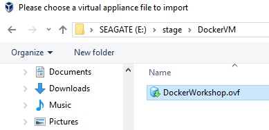

- Once the File is selected click **Next** to continue.

    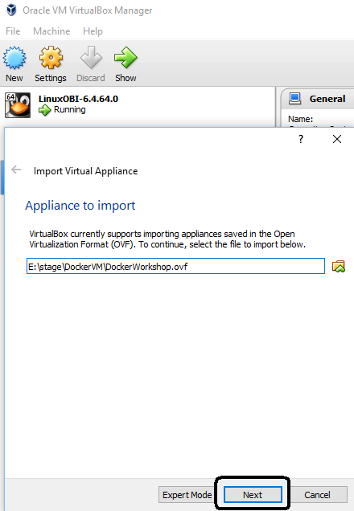

- Keep all the defaults and click **Import**

    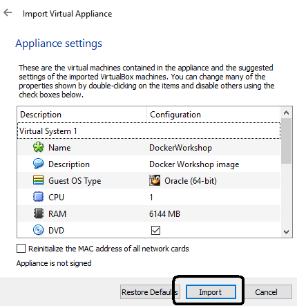

- Wait for import to complete. The time required to import will vary depending on the speed of your hard disk.

    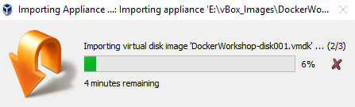

### **STEP 6**: Start Virtual Box Image

- After completion of the import, you should see the DockerWorkshop image in a Powered Off state. The default settings will work, but if you are familiar with Virtual Box, you are welcome to change any of the settings.

    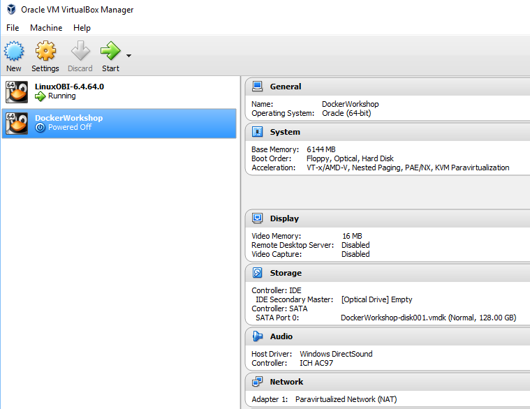

- With **DockerWorkshop** selected, click **Start**.

    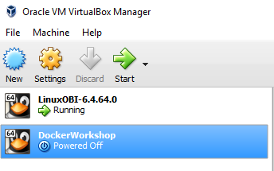

- After a few minutes you will have a running image that will be used for all of the labs.

    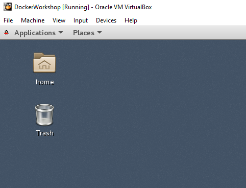

### **STEP 7**: Begin Lab 100

- Click on the hamburger menu in the top left corner of the webpage.

    

- Select Lab 100 and begin the workshop.

    
    
## _Option 2: Install Client Software on Your Laptop_

### **Step 1**: Obtain a Docker Account

- If you do not have a Docker Hub account please go to [Docker Hub](https://hub.docker.com/), fill out the fields illustrated below and press signup.

    

### **Step 2**: Install Docker on your Mac OS

- Navigate to [Docker Installation](https://docs.docker.com/install/) and follow the instructions specific to Mac.

### **STEP 3**: Begin Lab 100

- Click on the hamburger menu in the top left corner of the webpage.

    

- Select Lab 100 and begin the workshop.

    