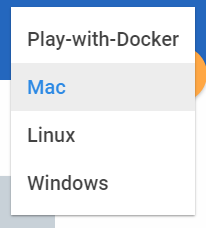

# Readme First

## IMPORTANT: How to prepare for this workshop

- This workshop documentation is best viewed by [clicking this link](https://oracle.github.io/learning-library/workshops/docker/)

## Configure your Client Environment

- Your client environment **must be configured prior** to attempting the Hands-on-Workshop labs.
- You will need to obtain a Docker Hub account at: [Docker Hub](https://hub.docker.com/)
- You have two options for configuring your workshop client environment:
    - ***Option 1:*** You can install Virtual Box and download and run a pre-configured **Virtual Box Image**.
    - ***Option 2:*** You can **install and configure** Docker on your laptop. Installation will be OS specific. For Windows OR Mac the documentation assumes a "Docker Toolbox" installation (although you could also use the "Docker for Windows - Hyper-V" installation which requires specific levels of the Windows OS). Linux installs; depending on your flavor of Linux can be installed via "yum" or "apt-get". There are many references on the web for installing docker on your specific version of Linux. Please refer to one of the the Student Guides below.

- **Virtual Box set up and generic Docker installation is documented** in the [Student Guide](StudentGuide.md).

- **A Mac specific Student Guide** is in [Mac Student Guide](MacStudentGuide.md).

## How to View the Lab Guides

- The Lab Guides are best viewed using the Workshop [GitHub Pages Website URL](https://oracle.github.io/learning-library/workshops/docker/)
- Once you are viewing the Workshop's GitHub Pages website, you can select from a list of OS specific Lab Guides at any time by clicking on the **Play-with-Docker** drop list:

    

- Select the Mac item to select your lab guides:

    

    **NOTE:** ***The Play-with-Docker option only allows you to do the first lab introducing docker concepts and a simple deployment***

- The operating system specific lab guides will be available by selecting from the hamburger menu:

      

- To log issues and view the Lab Guide source, go to the [github oracle](https://github.com/oracle/learning-library/issues/new) repository.

- Visit the [Workshop Interactive Labguide](https://launch.oracle.com/?docker-workshop) for a visual overview of the workshop content.

## Docker Workshop

This Docker workshop will walk you through using common docker commands, download docker images, creating containers and deploying a full blown application. The first Lab starts by examining a docker environment and deploying a simple application UI (AlphaOffice). The second Lab expands on functionality by deploying and configuring a database of your choice (Oracle or MYSQL), creating a user and populating the user schema. Next, it has you deploy various supporting components of the AlphaOffice application (TwitterFeed, RESTClient that communicates to the database you configure, and the AlphaOffcieUI Node.js application). Finally in Lab 200 you will modify the UI container, save a new version and test your changes.

## Workshop Details

**Reference the following Lab Guides by opening their Documentation Files:**

## Lab 100: Docker Introduction and Deployment

**Documentation**: Lab guide will depend on your OS (Mac, Linux or Windows)
Lab guide shown here: [Mac100.md](Mac100.md)

### Objectives

- Deploy and test a simple docker container running a simple application
- Introduce and use the Dockerhub registry
- Familiarize yourself with Docker commands (ps, run, exec)
- Understand foundational concepts of container networking and filesystem mapping

## Lab 200: Application Deployment using a Database

**Documentation**: Lab guide will depend on your OS (Mac, Linux or Windows) Lab guide shown here: [Mac200.md](Mac200.md)

### Objectives

- Deploy and test the AlphaOffice application
    - Choose and configure your datasource
    - Deploy the datasource, TwitterFeed, RESTClient and AlphaOfficeUI containers
- Once the application has been deployed
    - Make changes
    - Create a new Docker image
    - Fire up a container based on the new image
    - Push this image your personal Docker Hub account
