# Docker Workshop

 

Updated: January 24, 2018

## Overview

What is Docker? What is a container?

- Docker is the company and containerization technology.
- [Docker Documentation](https://docs.docker.com)
- A container is a runtime instance of a docker image: [Container Documentation](https://docs.docker.com/glossary/?term=container)

Containers have been around for many years. Docker created a technology that was usable by mere humans, and was much easier to understand than before. Thus, has enjoyed a tremendous amount of support for creating a technology for packaging applications to be portable and lightweight.

**VM vs Container**


While containers may sound like a virtual machine (VM), the two are distinct technologies. With VMs each virtual machine includes the application, the necessary binaries and libraries and the entire guest operating system.

Whereas, Containers include the application, all of its dependencies, but share the kernel with other containers and are not tied to any specific infrastructure, other than having the Docker engine installed on it’s host – allowing containers to run on almost any computer, infrastructure and cloud.

## Introduction

In this lab we introduce some basic concepts of Docker, container architectures and functions.  We will do this using a single container which provides a REST service as part of a node.js application.  The application has two pieces, which provide a microservice.

- Datasource: a simple JSON file included in the container
- REST Client: To serve up data from the datasource

You will use various Docker commands to setup, run and connect into containers. In this introduction you will explore concepts of Docker volumes, networking and container architecture.

***To log issues***, click here to go to the [github oracle](https://github.com/oracle/learning-library/issues/new) repository issue submission form.

## Objectives

- Deploy and test a simple docker container running a simple application
- Introduce and use the Docker Hub registry
- Familiarize yourself with Docker commands (ps, run, exec)
- Understand foundational concepts of container networking and filesystem mapping

## Required Artifacts

- Docker Hub Account: [Docker Hub](https://hub.docker.com/)
- Docker and GIT installed in your own environment (this guide is tailored to Windows) you can decide if you want to run locally
    - OR, you can use an available Linux based VirtualBox image

# Start up and login into your Windows environment

If you chose to use your own installation then login and verify that the Docker engine is up and running. 

**NOTE**: The screen shots in this lab guide are using Windows 10 Pro with "Docker Toolbox" installed

## Verify Docker Installation

### **STEP 1**: Open up a Terminal Window

- Right-click and open up a Quickstart Terminal session.

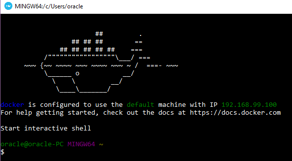

### **STEP 2**: Verify that Docker is running

- **Type** the following:

```
docker version
```

The information on your docker engine should be displayed:


### **STEP 3**: See What is running

Let's take a quick look at what is running in the docker engine, if this is a new environment, you should see no docker containers running.

- **Type** the following:

```
docker ps
```

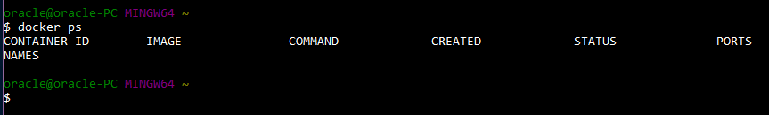

### **STEP 4**: Run the restclient docker image from docker hub

We will now download and create a container based on an existing docker image stored in the Docker Hub. It uses a JSON formatted datafile to serve the test data via its exposed REST service. Docker looks for the designated image locally first before going to Docker HUB.

- Let's take a look at what the docker **run** command options do:
    - "-d" flag runs the container in the background
    - "-it" flags instructs Docker to allocate a pseudo-TTY connected to the
    container’s stdin, creating an interactive bash capable shell in the container (which we will use in a moment when we connect into the container)
    - "--rm" When this container is stopped all resources associated with it (storage, etc) will be deleted
    - "--name" The name of the container will be "restclient"
    - "-p" Port 8002 is mapped from the container to port 8002 on the HOST
    - "-e" Environment variables used by the application. "DS" setting designates the JSON datasource.

- **Type OR cut and paste** the following (all on one line):

```
docker run -d -it --rm --name restclient -p=8002:8002 -e DS='json' wvbirder/restclient
```

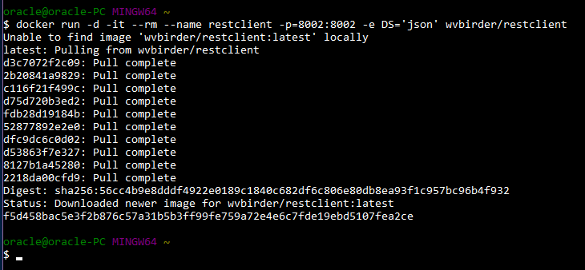

### **STEP 5**: Check running containers

Again using the `docker ps` command, we should see our newly spawned docker container

- **Type** the following:

```
docker ps
```

- Note that the container id is unique, and the container's port is mapped to 8002, which is the same as the Host's port.

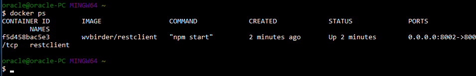

### **STEP 6**: Setup Port Forwarding

In Linux all container ports published on the HOST server get mapped to the networking loopback interface (127.0.0.1 otherwise known as "localhost"). This has not been the case with Windows until very recently. Since the application we are going to deploy has references to "locahost" we will make changes to our Virtual Box NAT adapter to allow mapping the Virtual Box Lunix VMs ports to "localhost" on our Windows server.

- Open up Virtual Box and select the `default` Linux VM running our docker environment

- Click on **Settings-->Network-->Adpater 1-->Advanced**


- Click the **Port Forwarding** button


- You will now add the ports that the `restclient` container will be exposing from the linux VM during the remainder of this lab. They are 8002 and 18002. Initially only the ssh port has been mapped.

- Click the **plus +** icon for each new entry and enter the following for **Name**, **Host Port**, **Guest Port**:

```
restclient       8002   8002
restclient2     18002  18002
```

- When you're done the setup should look like:


Click **OK, (TWICE)** to exit out. The ports are dynamically assigned to the VM.

### **STEP 7**: Check the Application with a browser

- Navigate in a browser to:

```
http://localhost:8002/
```


Now check :  http://localhost:8002/products


### **STEP 8**: Stop the Container

Since we started the `restclient` container with the --rm option stopping it docker will remove ALL allocated resources

- **Type** the following:

```
docker stop restclient
```

- Now, entering `docker ps -a` (which will show the status of ALL containers RUNNING or STOPPED) shows nothing proving the container was deleted upon stopping it.

- **Type** the following:- 

```
docker ps -a
```

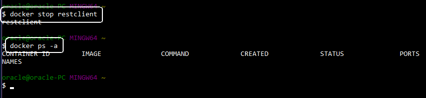

### **STEP 9**: Start another Container with a different HOST Port

- Start another container using the Host's 18002 port:

- **Type** the following:

```
docker run -d -it --rm --name restclient -p=18002:8002 -e DS='json' wvbirder/restclient
```

- If you change your browsers port to 18002, you will now see that localhost is using port 18002 and mapped from our container's port 8002 as shown using the "-p"

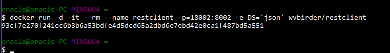


### **STEP 10**: Inspect the Container's Network and IP Address

- You can get various bits of subnet information that the restclient docker container is running on by inspecting the default network bridge docker creates out-of-the-box. You can also create your own networks and assign containers to them but that is out of the scope of this lab. 

- **Type** the following:

```
docker network inspect bridge
```

- This returns information of all the containers running on the default bridge. At this point we see that our `restclient` container is assigned IP Address 172.17.0.2. We'll make some changes so that can you can ping that address from the Windows HOST.

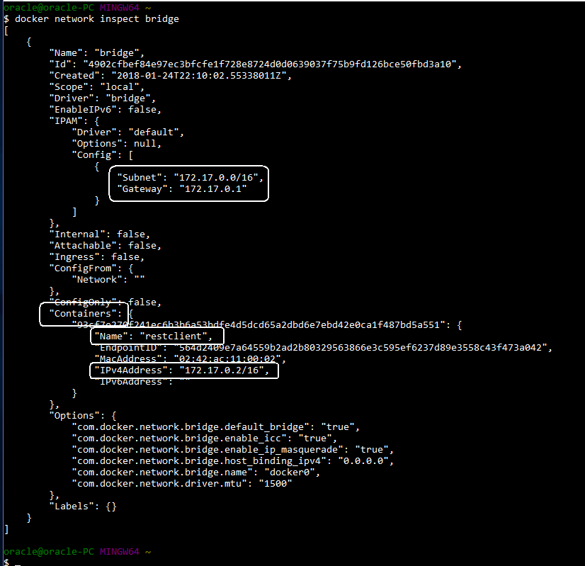

### **STEP 11**: Add a Network Route

The Windows Toolbox version of docker installs a Virtual Box VM named "default" running on **192.168.99.100**. There is NO default networking route to the docker0 network bridge running in that VM from the Windows HOST. We will now create a route so we can directly access the docker container from the HOST.

- Double check the Linux VM IP Address:

- **Type** the following:

```
docker-machine ip default
```

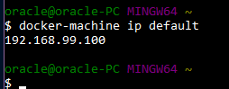

- Now, verify that you CANNOT ping the container IP address obtained in the previous step:

- **Ping** the container IP obtained above. (Example shown):

```
ping 172.17.0.2
```

- Timeouts will occur...

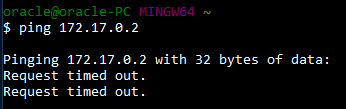

- Open up a `cmd` or `PowerShell` window **with Administrator access**. ( This example shows Powershell):


- Add a route table entry using the restclient container's subnet (NOT IP) obtained in STEP 10 and the Linux VM IP obtained above using the docker-machine command: (For this example **172.17.0.0** and **192.168.99.100** are used respectively)

```
route add 172.17.0.0 mask 255.255.0.0 192.168.99.100 -p
```

- Completion should return "**OK**"

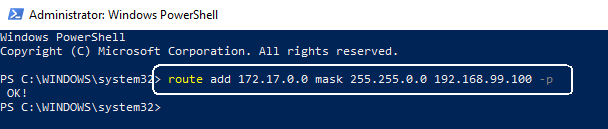

- Veriy the route entry by **typing**:

```
route print
```

- (You should find the entry in the Persistent Routes section - this will survive reboots)

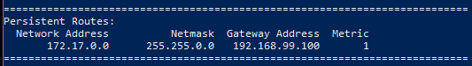

- Now you should be able to directly ping the `restclient` container from the Windows HOST:

- **ping** the IP again:

```
ping 172.17.0.2
```

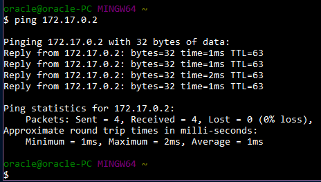

- **ping** the IP again:

```
ping 172.17.0.2
```

- Finally, **STOP** the `restclient` container as we will be re-using it in Lab 200 by **typing**:

```
docker stop restclient
```

**This completes the Lab!**
